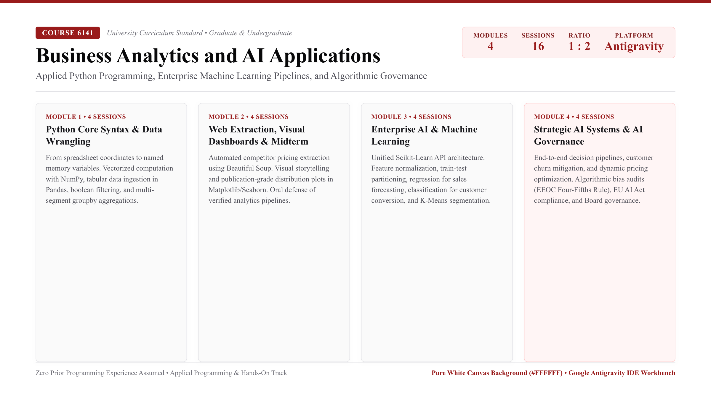

# Business Analytics and AI Application (Course 6141)

## Course Overview

Students in this course will develop a comprehensive understanding of business analytics and artificial intelligence fundamentals, covering topics such as business requirement analysis, data collection, and machine learning. Designed specifically for undergraduate and Master of Business Administration (MBA) students with zero prior programming background, this course emphasizes intuitive, evidence-based reasoning over abstract theoretical complexity.

Through hands-on exercises, students gain operational proficiency in Python programming, progressing from core syntax to intermediate techniques essential for enterprise data projects. Students acquire data manipulation skills using foundational libraries including NumPy and Pandas for data cleaning, aggregation, and financial visualization. They also master automated web data extraction techniques using HyperText Markup Language (HTML), Cascading Style Sheets (CSS), and Beautiful Soup to collect public competitor intelligence. 

With an introduction to modern machine learning tools through Scikit-Learn, participants learn to implement, interpret, and evaluate predictive models. Ethical considerations in artificial intelligence projects, algorithmic risk management, and governance frameworks are examined to ensure the responsible application of these analytical technologies.

## Table of Contents

* **Module 1: Foundations of Business Analytics and Python Programming**
  * [Session 1.1: Business Analytics Architecture, Google Antigravity IDE Initialization, and Core Arithmetic](#session-1-1)
  * [Session 1.2: Essential Python Syntax Completion: Control Flow, Collections, and Business Automation](#session-1-2)
  * [Session 1.3: Tabular Data Wrangling Part 1: NumPy Arrays, Pandas DataFrames, and CSV Ingestion](#session-1-3)
  * [Session 1.4: Tabular Data Wrangling Part 2: Advanced Filtering, Multi-Segment GroupBy, and Financial Auditing](#session-1-4)
* **Module 2: Web Data Extraction, Visual Dashboards, and Midterm Milestone**
  * [Session 2.1: Web Data Extraction: Scraping Financial and Competitor Intelligence with Beautiful Soup](#session-2-1)
  * [Session 2.2: Business Data Visualization: Exploratory Plotting and Executive Dashboards](#session-2-2)
  * [Session 2.3: Midterm Applied Analytics Formulation Part 1: Problem Structuring and Data Audit](#session-2-3)
  * [Session 2.4: Midterm Analytics Pipeline Defense Part 2: Exploratory Findings and Executive Review](#session-2-4)
* **Module 3: Artificial Intelligence, Machine Learning Fundamentals, and Scikit-Learn**
  * [Session 3.1: Foundations of Artificial Intelligence: Enterprise Value Creation and Decision Automation](#session-3-1)
  * [Session 3.2: Advanced Data Analysis: Feature Engineering, Scaling, and Business Data Preprocessing](#session-3-2)
  * [Session 3.3: Practical Machine Learning with Scikit-Learn: Model Training and Validation](#session-3-3)
  * [Session 3.4: Core Concepts of Machine Learning: Supervised vs. Unsupervised Learning and Evaluation Metrics](#session-3-4)
* **Module 4: Strategic AI Integration, Enterprise Decision-Making, and AI Governance**
  * [Session 4.1: Integration of Business Analytics and Enterprise AI Architecture: End-to-End Decision Systems](#session-4-1)
  * [Session 4.2: AI Applications in Business Decision-Making Part 1: Predictive Customer Analytics and Churn](#session-4-2)
  * [Session 4.3: AI Applications in Business Decision-Making Part 2: Pricing Optimization and Revenue Management](#session-4-3)
  * [Session 4.4: Ethical Considerations in Artificial Intelligence: Algorithmic Bias, Regulatory Compliance, and AI Governance](#session-4-4)

---

## Module 1: Foundations of Business Analytics and Python Programming

Module 1 establishes the computational foundation for business students. Students learn to translate executive business questions into structured quantitative workflows, set up a standardized Python execution environment, master variables and arithmetic for commercial metrics, control program flow, and inspect tabular corporate filings using Pandas.

<a id="session-1-1"></a>
### Session 1.1: Business Analytics Architecture, Google Antigravity IDE Initialization, and Core Arithmetic

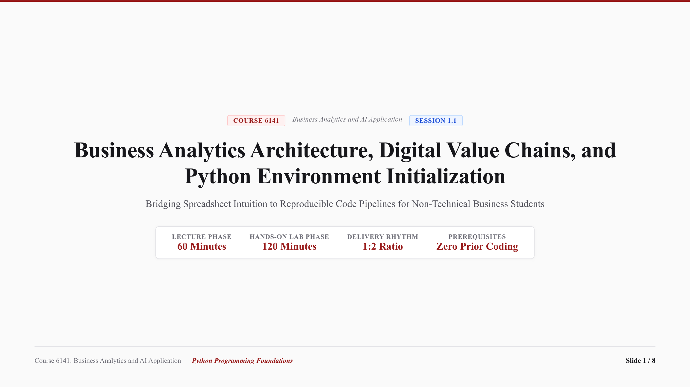

* **Lecture Presentation:** [Download Slides (PDF)](slides/session_1_1_lecture.pdf)

* **Keywords (Core Programming Concepts):**
  * `Python Interpreter`: The computational engine that reads Python source code and executes instructions sequentially line-by-line in real time without requiring compilation.
  * `Variable Assignment`: Storing data in computer memory using an assignment operator (`=`) and an intuitive descriptive label (such as `net_sales = 574785.0`), replacing fragile cell coordinates like `C13`.
  * `Primitive Data Types`: The foundational categories of information processed by Python: whole numbers (`int`), decimal numbers (`float`), and text strings (`str`).
  * `Traceback & Exception`: The automatic diagnostic navigation report generated by Python when an instruction violates a syntax or runtime rule, pinpointing the exact file and line number.
  * `Integrated Development Environment (IDE)`: A unified software workstation (Google Antigravity IDE) providing an editor, execution terminal, file explorer, and integrated AI assistant in a single interface.

* **Core Programming & Computational Foundations:**
  * Sequential Execution & Program State: Python executes code strictly line-by-line from top to bottom. Unlike spreadsheets where formulas across sheets can trigger circular reference loops, Python code maintains a clear, linear flow where each statement computes or alters memory state sequentially.
  * Cell Coordinate Formulas vs. Descriptive Variables: Transitioning from Excel spatial grid thinking (such as `=C13-E13`) to self-documenting computational recipes (`operating_expense = net_sales - operating_income`). Code variables retain clear business meaning and eliminate silent formula drift.
  * Interpreter Diagnostics & Traceback Mechanics: Python acts as an interactive assistant. When a syntax or naming rule is violated, Python pauses and outputs a Traceback pointing to the exact line number and cause, turning errors into immediate learning signals rather than system failures.

* **Hands-On Coding Micro-Examples:**
  * *Micro-Example 1 (Variable Arithmetic):* Defining commercial numbers (`net_sales = 574785.0`, `operating_income = 36852.0`) and calculating Operating Expense and Operating Margin Percentage with standard math operators (`-`, `/`, `*`).
  * *Micro-Example 2 (Dynamic Parameter Reusability):* Changing a single baseline assumption (such as revising sales tax or discounting prices by 5%) and observing how Python recalculates all downstream figures instantaneously without manual cell dragging.
  * *Micro-Example 3 (Traceback Troubleshooting & AI Fix):* Creating an intentional variable typo (`netsales` instead of `net_sales`), observing the `NameError` in the terminal, capturing it with `Windows Key + Shift + S`, and pasting into the AI chat to verify how the co-pilot identifies the typo and supplies the correction.

* **Lab Practice Dataset:**
  * File Link: [data/session_1_1_dataset.csv](data/session_1_1_dataset.csv)
  * Simple 4-row tabular financial dataset used to verify calculations:
    * `Segment_Name`: North America, International, AWS, Consolidated Total.
    * `Net_Sales_USD_M`: Revenue in millions of U.S. Dollars.
    * `Operating_Income_USD_M`: Operating income in millions of U.S. Dollars.

* **Official Python Documentation & References:**
  * [Python 3.12 Official Tutorial: Using Python as an Interactive Calculator](https://docs.python.org/3/tutorial/introduction.html#using-python-as-a-calculator).
  * [PEP 8: Style Guide for Python Code (Readability and Variable Naming Standards)](https://peps.python.org/pep-0008/).
  * [Google Antigravity IDE Quickstart: Workspace Panels and AI Pair Programming](https://antigravity.google/docs).

* **Integrated Development Environment Architecture (Google Antigravity IDE):**
  * Students use Google Antigravity IDE, a modern AI-powered development environment designed for business analytics, financial modeling, and collaborative data science.
  
  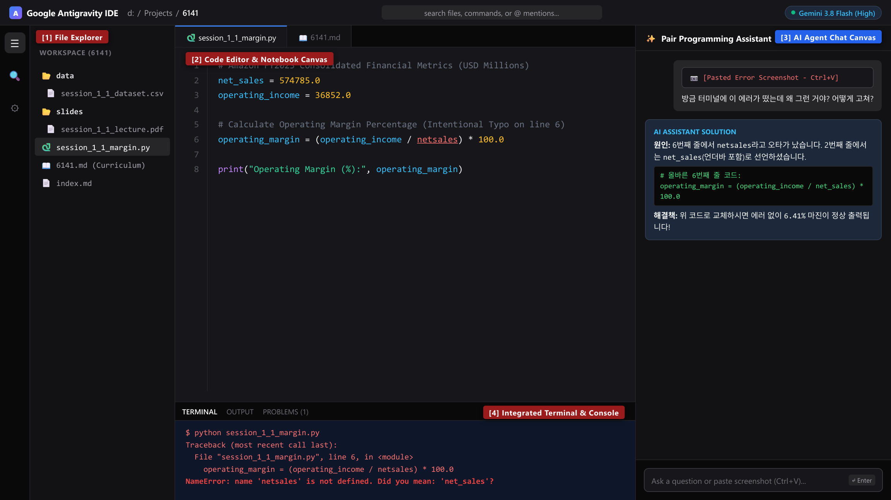

  * **The 4 Workspace Panels:**
    * `[1] File Explorer (Left Panel):` Workspace file hierarchy. Used to organize corporate datasets (`data/`), slide decks (`slides/`), Python scripts (`.py`), and curriculum documentation (`.md`).
    * `[2] Code Editor & Notebook Canvas (Center Top):` Primary workspace for writing Python code, defining financial variables, and executing arithmetic business formulas.
    * `[3] AI Agent Chat Canvas (Right Panel):` An interactive AI pair-programming assistant powered by Gemini. Students paste code snippets or error screenshots directly into this window to receive plain-English root cause explanations and verified code corrections.
    * `[4] Integrated Terminal & Console (Center Bottom):` Command line interface running the Python execution kernel. Displays script output results and detailed system error tracebacks.

  * **AI Error Diagnosis Protocol (Capture and Resolve in Seconds):**
    * *Zero Fear Principle:* In Python, an error is not a system failure or a test penalty. It is simply a diagnostic navigation clue (Traceback) showing the exact line number and rule violation.
    * *Step A (Identify):* When code execution stops, look at the last line in Panel `[4]` (Terminal), which names the error type (e.g., `NameError`, `SyntaxError`, `TypeError`).
    * *Step B (Capture):* Take a fast screen capture of the error message using `Windows Key + Shift + S` (Windows) or `Command + Shift + 4` (macOS).
    * *Step C (Paste & Prompt):* Click inside Panel `[3]` (AI Agent Chat), press `Ctrl + V` to attach the captured image, and ask: *"Why did this error happen, and what is the exact corrected code?"*
    * *Step D (Apply):* Review the AI explanation, understand the typo or missing parenthesis, and copy the verified fix back into Panel `[2]`.

* **Step-by-Step Lab Protocol (Exercise 1: Foundational Practice):**
  * *Step 1: Open Environment & Dataset:* Launch Google Antigravity IDE. Place `data/session_1_1_dataset.csv` in your working directory and open the raw file via Panel `[1]` (File Explorer) to observe comma-separated tabular records.
  * *Step 2: Inspect Primary Sources & Financial Terminology:* Confirm against Note 15 of Amazon's Form 10-K that Consolidated Net Sales for FY2023 equaled `$574,785` million and Operating Income equaled `$36,852` million.
  * *Step 3: Define Variables and Execute First Python Calculations:*
    In your first Python notebook cell, type the following arithmetic statements and run the cell:
    ```python
    # Amazon Consolidated Financial Metrics for FY2023 (in USD Millions)
    net_sales = 574785.0
    operating_income = 36852.0

    # Calculate Operating Expenses
    operating_expense = net_sales - operating_income

    # Calculate Operating Margin Percentage
    operating_margin_pct = (operating_income / net_sales) * 100.0

    print("Operating Expense (USD M):", operating_expense)
    print("Operating Margin (%):", round(operating_margin_pct, 2))
    ```
  * *Step 4: Bridge Excel Spreadsheet Mechanics to Python Code:*
    * In Microsoft Excel, if `Net_Sales` is in cell `C13` (`574785.00`) and `Operating_Income` is in cell `E13` (`36852.00`), the expense formula in cell `D13` is `=C13-E13`, and the margin formula in cell `F13` is `=(E13/C13)*100`.
    * Notice that Python variable assignment (`operating_income / net_sales`) performs the identical mathematical operation as cell references, but uses memorable descriptive English words instead of abstract grid coordinates like `E13`.
  * *Step 5: Compare Segment Profitability:*
    Execute a comparative calculation for Amazon Web Services (AWS) in FY2023:
    ```python
    aws_sales = 90757.0
    aws_income = 24631.0
    aws_margin_pct = (aws_income / aws_sales) * 100.0
    print("AWS Operating Margin (%):", round(aws_margin_pct, 2))
    ```
    Confirm that the AWS operating margin (`27.14%`) is over four times higher than the consolidated corporate operating margin (`6.41%`), demonstrating how cloud infrastructure drives corporate operating cash flow.

* **Step-by-Step Applied Coding Practice (Exercise 2+: Hands-On Programming & Debugging):**
  * *Coding Challenge:* In Google Antigravity IDE, create a new script named `session_1_1_practice.py` to calculate financial metrics across multiple business units and practice error debugging.
  * *Task 1 (Segment Margin Calculation):* Define variables for Amazon Web Services (AWS) using FY2023 figures (`aws_sales = 90757.0`, `aws_income = 24631.0`). Compute `aws_margin_pct` and print the formatted result with `round(..., 2)`.
  * *Task 2 (Intentional Syntax Error & AI Diagnosis):* Deliberately omit the closing parenthesis in your `print()` statement (e.g., `print("AWS Margin:", round(aws_margin_pct, 2)`). Run the script in Panel `[4]` (Terminal), observe the `SyntaxError`, capture the terminal message using `Windows Key + Shift + S`, paste it into Panel `[3]` (AI Agent Chat) with `Ctrl + V`, and verify the AI's explanation and fix.
  * *Task 3 (Multi-Unit Comparison Output):* Combine consolidated and cloud margin calculations into a single clean script that prints both metrics formatted with labels. Verify that the script executes with return code 0.

---

<a id="session-1-2"></a>
### Session 1.2: Essential Python Syntax Completion: Control Flow, Collections, and Business Automation

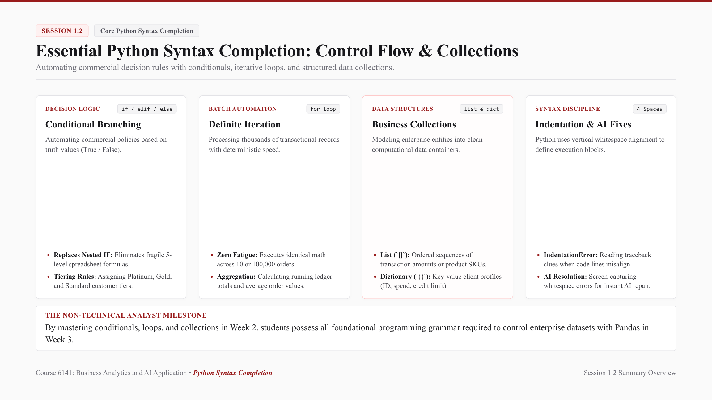

* **Lecture Presentation:** [Download Slides (PDF)](slides/session_1_2_lecture.pdf)
* **Schedule:** Week 2 (115/09/20 - 115/09/26) | In-person classes (1:2 Delivery Ratio: 60 Min Lecture + 120 Min Lab)

* **Keywords (Core Programming Concepts):**
  * `Boolean Expression`: A logical comparison that evaluates strictly to `True` or `False`, used by computers to test commercial conditions (such as `annual_spend >= 50000.0`).
  * `Conditional Branching (else)`: Directing code execution down distinct logical pathways depending on operational thresholds, eliminating complex spreadsheet nested logic.
  * `List Collection`: An ordered, mutable sequence of business records enclosed in square brackets (e.g., `daily_orders = [120, 85, 94, 142]`), indexed sequentially starting from zero.
  * `Dictionary Collection`: A key-value associative data structure enclosed in curly braces (e.g., `{"client_id": "CUST-101", "annual_spend_USD": 145000.0}`), enabling instant data retrieval by descriptive business keys rather than numeric indices.
  * `Definite Iteration (for loop)`: A programmatic control structure that automatically iterates over every record in a collection, executing identical business rules across thousands of entries in milliseconds.

* **Core Programming & Computational Foundations:**
  * Eliminating Fragile Nested Spreadsheets: In Excel, multi-tier decision policies require nested formulas such as `=IF(C2>100000, "Platinum", IF(C2>50000, "Gold", IF(C2>20000, "Silver", "Standard")))`. These formulas quickly become unreadable, impossible to audit, and vulnerable to formula drift. In Python, conditional branching (`if-elif-else`) structures business rules into clean vertical indentation blocks that mirror managerial decision trees.
  * Deterministic Repetition over Human Fatigue: When processing transactional ledgers with thousands of rows, human analysts experience fatigue, eye strain, and copy-paste errors. A Python `for` loop executes repetitive calculations across 10 records or 1,000,000 records with identical mathematical precision and zero cognitive degradation.
  * Real-World Entity Modeling with Dictionaries: Modeling complex commercial entities as structured computational objects. A single customer account is captured as a dictionary of labeled attributes (name, industry, spend, risk score), while an enterprise client portfolio is structured as an iterable list of dictionaries.
  * Indentation as Syntax Structure (The Whitespace Discipline): Unlike older programming languages that use curly brackets `{}` or `BEGIN/END` tokens, Python enforces clean code formatting through whitespace indentation (4 spaces). An `IndentationError` occurs when code blocks are misaligned, serving as an automated guardrail for code readability.

* **Hands-On Coding Micro-Examples:**
  * *Micro-Example 1 (Conditional Customer Tiering):*
    Evaluating client annual spend to determine customer loyalty tiers and discount rates:
    ```python
    annual_spend = 82000.0

    if annual_spend >= 100000.0:
        tier = "Platinum"
        discount_rate = 0.15
    elif annual_spend >= 50000.0:
        tier = "Gold"
        discount_rate = 0.10
    elif annual_spend >= 20000.0:
        tier = "Silver"
        discount_rate = 0.05
    else:
        tier = "Standard"
        discount_rate = 0.0

    print(f"Customer Tier: {tier} | Approved Discount: {discount_rate * 100:.0f}%")
    ```
  * *Micro-Example 2 (Iterative Revenue Accumulation):*
    Looping through a list of daily store sales to calculate cumulative revenue and average daily performance:
    ```python
    daily_sales = [4200.0, 5100.0, 3900.0, 6200.0, 7800.0, 8400.0, 4900.0]
    total_revenue = 0.0

    for sale in daily_sales:
        total_revenue += sale

    avg_daily_sales = total_revenue / len(daily_sales)
    print("Total Weekly Revenue (USD):", round(total_revenue, 2))
    print("Average Daily Sales (USD):", round(avg_daily_sales, 2))
    ```
  * *Micro-Example 3 (Dictionary Client Profile & Safe Retrieval):*
    Storing commercial account attributes in a dictionary and computing available credit limits:
    ```python
    client = {
        "client_id": "CUST-104",
        "company_name": "Apex Logistics",
        "annual_spend_USD": 215000.0,
        "credit_limit_USD": 75000.0,
        "outstanding_balance_USD": 23400.0
    }

    available_credit = client["credit_limit_USD"] - client["outstanding_balance_USD"]
    print(f"{client['company_name']} Available Credit: ${available_credit:,.2f}")
    ```

* **Lab Practice Dataset:**
  * File Link: [data/session_1_2_dataset.csv](data/session_1_2_dataset.csv)
  * Standard 10-row commercial client dataset used for batch automation and loop exercises:
    * `Customer_ID`: Unique client identification code (e.g., `CUST-101`).
    * `Industry_Segment`: Commercial vertical (Retail, Technology, Healthcare, Finance, Manufacturing).
    * `Annual_Spend_USD`: Total historical purchase volume in U.S. Dollars.
    * `Order_Count`: Total orders completed in the fiscal year.
    * `Avg_Order_Value_USD`: Average transaction size in U.S. Dollars.
    * `Payment_Terms_Days_Count`: Invoiced credit settlement period (30, 60, 90 days).
    * `Risk_Score_Count`: Internal risk assessment index (1 to 100).

* **Official Python Documentation & References:**
  * [Python 3.12 Official Tutorial: More Control Flow Tools (if Statements and for Loops)](https://docs.python.org/3/tutorial/controlflow.html).
  * [Python 3.12 Official Tutorial: Data Structures (Lists, Dictionaries, and Tuples)](https://docs.python.org/3/tutorial/datastructures.html).
  * [PEP 8: Style Guide for Python Code (Indentation and Whitespace Standards)](https://peps.python.org/pep-0008/#indentation).

* **Step-by-Step Lab Protocol (Exercise 1: Guided Practice - Client Portfolio Automation):**
  * *Step 1: Create Practice File:* Launch Google Antigravity IDE and create a new script named `session_1_2_automation.py` in your working directory.
  * *Step 2: Build a Client Portfolio List:*
    Define an iterable list of customer dictionaries containing audited client records from `data/session_1_2_dataset.csv`:
    ```python
    clients = [
        {"id": "CUST-101", "segment": "Retail", "spend": 145000.0, "risk": 15},
        {"id": "CUST-102", "segment": "Technology", "spend": 82000.0, "risk": 22},
        {"id": "CUST-103", "segment": "Healthcare", "spend": 31000.0, "risk": 38},
        {"id": "CUST-104", "segment": "Finance", "spend": 215000.0, "risk": 12},
        {"id": "CUST-105", "segment": "Manufacturing", "spend": 64000.0, "risk": 45}
    ]
    ```
  * *Step 3: Automate Tier Assignment and Credit Multiplier via for Loop:*
    Write a `for` loop that iterates over each client, applies conditional branching based on `spend`, and computes an approved credit limit:
    ```python
    for c in clients:
        # Tiering logic based on annual purchase volume
        if c["spend"] >= 100000.0 and c["risk"] < 30:
            c["tier"] = "Platinum"
            c["credit_limit"] = c["spend"] * 0.40
        elif c["spend"] >= 50000.0 and c["risk"] < 50:
            c["tier"] = "Gold"
            c["credit_limit"] = c["spend"] * 0.25
        else:
            c["tier"] = "Standard"
            c["credit_limit"] = c["spend"] * 0.10

        print(f"Client {c['id']} ({c['segment']}): Tier={c['tier']} | Credit Limit=${c['credit_limit']:,.2f}")
    ```
  * *Step 4: Execute and Verify Output in Terminal:*
    Run the script in Panel `[4]` (Terminal) using `$ python session_1_2_automation.py`. Confirm that all 5 client accounts are evaluated and printed with proper credit limits.

* **Step-by-Step Applied Coding Practice (Exercise 2+: Hands-On Programming & AI Debugging):**
  * *Coding Challenge:* In Google Antigravity IDE, create a new script named `session_1_2_practice.py` to automate a multi-tier commercial commission payout pipeline.
  * *Task 1 (Tiered Commission Functionality):*
    A sales team records quarterly sales volumes: `sales_reps = [{"name": "Alice", "revenue": 142000.0}, {"name": "Bob", "revenue": 68000.0}, {"name": "Charlie", "revenue": 35000.0}]`. Write a loop calculating commission payouts: `12%` for revenue over `$100,000`, `8%` for revenue between `$50,000` and `$100,000`, and `5%` for revenue below `$50,000`.
  * *Task 2 (Deliberate IndentationError & AI Diagnosis):*
    Intentionally misalign one line inside the `if` block (e.g., adding 2 extra spaces or removing indentation). Run the script in Panel `[4]` (Terminal), observe the red `IndentationError: unexpected indent`, capture the terminal traceback with `Windows Key + Shift + S`, paste the image into Panel `[3]` (AI Agent Chat) with `Ctrl + V`, and review how the AI explains whitespace alignment.
  * *Task 3 (Dictionary Summary Output):*
    Correct the indentation, append the calculated `commission_payout` back into each rep's dictionary, and print a formatted compensation summary with zero syntax errors. Verify that the script terminates with return code 0.


<a id="session-1-3"></a>
### Session 1.3: Tabular Data Wrangling Part 1: NumPy Arrays, Pandas DataFrames, and CSV Ingestion

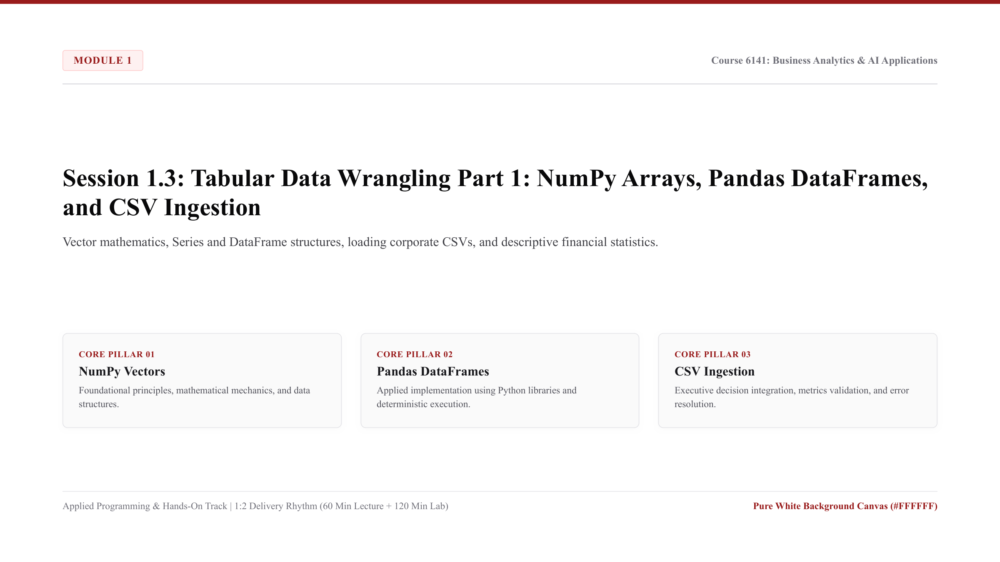

* **Lecture Presentation:** [Download Slides (PDF)](slides/session_1_3_lecture.pdf)
* **Schedule:** Week 3 (115/09/27 - 115/10/03) | In-person classes (1:2 Delivery Ratio: 60 Min Lecture + 120 Min Lab)

* **Keywords (Core Programming Concepts):**
  * `Vectorized Computation`: Executing mathematical operations across entire numeric arrays or data columns simultaneously in compiled C memory, replacing slow Python row-by-row loops.
  * `Pandas Series`: A one-dimensional labeled array in Pandas capable of holding any data type, representing a single column in an enterprise tabular dataset.
  * `Pandas DataFrame`: A two-dimensional, size-mutable tabular data structure with labeled axes (rows and columns), serving as the primary analytical workhorse for commercial data.
  * `Tabular CSV Ingestion`: Reading structured comma-separated corporate ledgers directly into memory using `pd.read_csv()`, parsing data types and column headers automatically.
  * `Explicit Data Selection (.loc[] vs .iloc[])`: Selecting specific subsets of records using label-based indexing (`.loc[]`) or integer position-based indexing (`.iloc[]`).

* **Core Programming & Computational Foundations:**
  * Vectorized Array Math vs. Row-by-Row Iteration: While Python `for` loops are intuitive, calculating metrics across 500,000 retail records using a loop is computationally slow. NumPy and Pandas use vectorized execution, operating on entire memory blocks in parallel, reducing execution time from seconds to milliseconds.
  * The Two-Dimensional DataFrame Structure: Bridging spreadsheet grids into structured programmatic objects. A Pandas DataFrame consists of an Index (row identifiers), Columns (attribute headers), and Values (underlying two-dimensional NumPy array).
  * Explicit Data Types and Memory Management: Unlike spreadsheets where a cell can silently mix text and numbers, Pandas enforces explicit column data types (`float64`, `int64`, `object`, `datetime64`). This prevents silent financial corruption during aggregation.
  * Declarative Data Inspection: Mastering instantaneous programmatic diagnostics using `.info()` (data types and null counts), `.describe()` (descriptive summary statistics), and `.shape` (row and column dimensions).

* **Hands-On Coding Micro-Examples:**
  * *Micro-Example 1 (Ingesting CSV and Inspecting Structure):*
    Loading a retail store dataset and inspecting dimensions and column data types:
    ```python
    import pandas as pd

    df = pd.read_csv("data/session_1_3_dataset.csv")
    print("Dataset Dimensions (Rows, Columns):", df.shape)
    print("Column Data Types:\\n", df.dtypes)
    print(df.head(3))
    ```
  * *Micro-Example 2 (Vectorized Financial Metric Calculation):*
    Calculating store operating profit and profit margin percentage across all stores without loops:
    ```python
    df["Operating_Profit_USD"] = df["Monthly_Sales_USD"] - df["Operating_Cost_USD"]
    df["Operating_Margin_Pct"] = (df["Operating_Profit_USD"] / df["Monthly_Sales_USD"]) * 100.0
    print(df[["Store_ID", "Monthly_Sales_USD", "Operating_Margin_Pct"]].head(3))
    ```
  * *Micro-Example 3 (Subsetting with .loc[] and Imputing Missing Values):*
    Filtering high-performing regional stores and handling missing footfall values safely:
    ```python
    # Select high-revenue stores in the West region
    west_high_sales = df.loc[(df["Region_Name"] == "West") & (df["Monthly_Sales_USD"] >= 150000.0)]
    
    # Impute missing satisfaction scores with median value
    median_score = df["Customer_Satisfaction_Score"].median()
    df["Customer_Satisfaction_Score"] = df["Customer_Satisfaction_Score"].fillna(median_score)
    print("Median Satisfaction Score Imputed:", median_score)
    ```

* **Lab Practice Dataset:**
  * File Link: [data/session_1_3_dataset.csv](data/session_1_3_dataset.csv)
  * Audited 12-row commercial store dataset used for vector arithmetic and filtering:
    * `Store_ID`: Unique retail location code (e.g., `STR-1001`).
    * `Region_Name`: Geographic division (East, West, North, South).
    * `Monthly_Sales_USD`: Gross store revenue in U.S. Dollars.
    * `Operating_Cost_USD`: Monthly operational store overhead in U.S. Dollars.
    * `Customer_Footfall_Count`: Total monthly foot traffic count.
    * `Customer_Satisfaction_Score`: Customer review rating (1.0 to 5.0 scale).

* **Official Python Documentation & References:**
  * [Pandas Official Documentation: 10 Minutes to Pandas](https://pandas.pydata.org/docs/user_guide/10min.html).
  * [Pandas Official Guide: Indexing and Selecting Data (.loc and .iloc)](https://pandas.pydata.org/docs/user_guide/indexing.html).
  * [NumPy Official Documentation: NumPy Quickstart Tutorial](https://numpy.org/doc/stable/user/quickstart.html).

* **Step-by-Step Lab Protocol (Exercise 1: Guided Practice - Retail Performance Wrangling):**
  * *Step 1: Open Workspace:* In Google Antigravity IDE, create a new script named `session_1_3_wrangling.py`. Verify that `data/session_1_3_dataset.csv` is present in Panel `[1]`.
  * *Step 2: Load and Verify Data:*
    Type the following Python statements to load the dataset and compute summary statistics:
    ```python
    import pandas as pd

    # Ingest audited retail dataset
    df = pd.read_csv("data/session_1_3_dataset.csv")

    # Vectorized column creation
    df["Operating_Profit_USD"] = df["Monthly_Sales_USD"] - df["Operating_Cost_USD"]
    df["Operating_Margin_Pct"] = (df["Operating_Profit_USD"] / df["Monthly_Sales_USD"]) * 100.0

    # Display executive summary
    summary = df.describe()
    print("Descriptive Financial Statistics:\\n", summary[["Monthly_Sales_USD", "Operating_Margin_Pct"]])
    ```
  * *Step 3: Compare Excel Mechanics with Pandas:*
    * In Excel, calculating operating margin requires typing `=(C2-D2)/C2*100` in cell `E2` and dragging it down across rows. If someone accidentally types a number into cell `E5`, the formula is permanently corrupted.
    * In Pandas, `df["Operating_Margin_Pct"]` applies the formula simultaneously to all records, preserving complete audit integrity.
  * *Step 4: Execute in Terminal:*
    Run the script via Panel `[4]` (Terminal) using `$ python session_1_3_wrangling.py`. Confirm that summary statistics are printed accurately.

* **Step-by-Step Applied Coding Practice (Exercise 2+: Hands-On Programming & AI Debugging):**
  * *Coding Challenge:* In `session_1_3_practice.py`, write a data filtering script that extracts all stores with `Operating_Margin_Pct >= 30.0%` and `Customer_Satisfaction_Score >= 4.5`.
  * *Task 1 (Targeted Filtering):* Use `.loc[]` to select the qualified stores and output only `Store_ID`, `Region_Name`, and `Operating_Margin_Pct`.
  * *Task 2 (Deliberate KeyError & AI Diagnosis):* Deliberately misspell a column name (e.g., `df["Monthly_Sale_USD"]` instead of `"Monthly_Sales_USD"`). Observe the terminal `KeyError`, capture the traceback with `Windows Key + Shift + S`, paste it into Panel `[3]` (AI Agent Chat) with `Ctrl + V`, and review how the AI explains DataFrame column key lookups.
  * *Task 3 (Clean CSV Export):* Correct the column name, sort the results by `Operating_Margin_Pct` descending, export the filtered table to `data/top_performing_stores.csv`, and verify return code 0.

---

<a id="session-1-4"></a>
### Session 1.4: Tabular Data Wrangling Part 2: Advanced Filtering, Multi-Segment GroupBy, and Financial Auditing

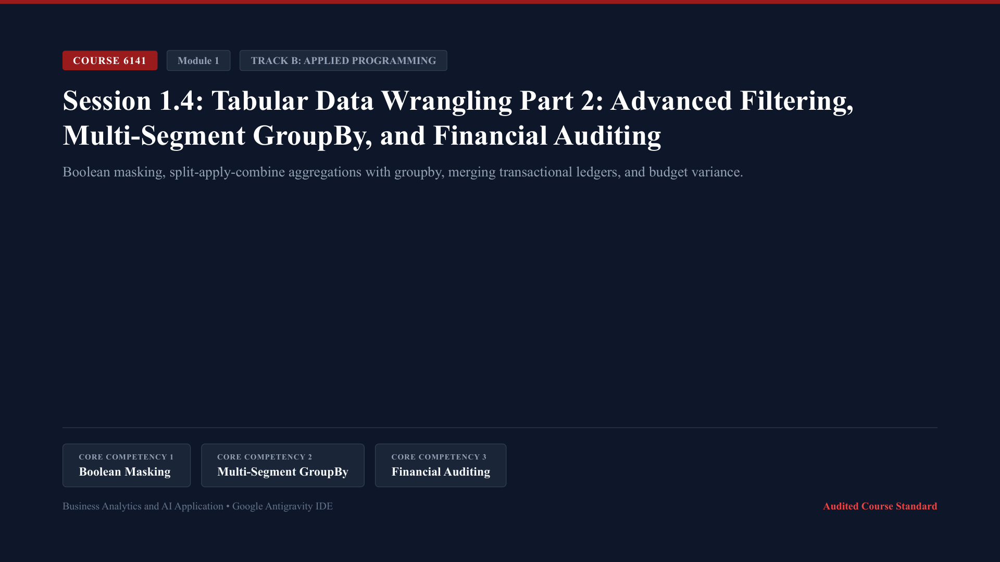

* **Lecture Presentation:** [Download Slides (PDF)](slides/session_1_4_lecture.pdf)
* **Schedule:** Week 4 (115/10/04 - 115/10/10) | In-person classes (1:2 Delivery Ratio: 60 Min Lecture + 120 Min Lab)

* **Keywords (Core Programming Concepts):**
  * `Boolean Masking`: Filtering tabular rows using boolean condition vectors combined with bitwise logical operators (`&` for AND, `|` for OR, `~` for NOT).
  * `Split-Apply-Combine Pattern`: The computational workflow of splitting data into operational groups, applying analytical functions, and combining results into an aggregated table.
  * `Multi-Metric Aggregation (.agg())`: Computing different statistical metrics simultaneously across multiple columns (e.g., total expenses, average variance, maximum transaction size).
  * `Relational Merging`: Joining two DataFrames based on common business keys (such as `Cost_Center_Code`), replacing error-prone spreadsheet `VLOOKUP` and `XLOOKUP` functions.
  * `Financial Variance Auditing`: Programmatically comparing actual transactional expenses against authorized budget baselines to flag cost center overruns.

* **Core Programming & Computational Foundations:**
  * Boolean Indexing at Enterprise Scale: In business reporting, filtering data across multiple conditions requires bitwise operators (`&`, `|`) because standard Python `and`/`or` operate on single scalar booleans, whereas Pandas evaluates element-wise boolean arrays.
  * The Split-Apply-Combine Paradigm: Grouping data by corporate dimensions (e.g., `Division_Name`, `Fiscal_Quarter`) to calculate sub-totals and unit economics without manually building pivot tables.
  * Relational Joins vs. Fragile Spreadsheet Lookups: Spreadsheet lookup formulas fail when columns are rearranged or when duplicate keys exist. A Pandas merge (`how="inner"`, `how="left"`) explicitly specifies match criteria and logs unmapped rows automatically.
  * Automated Audit Exception Flags: Constructing conditional categorical flags (e.g., `Variance_Flag` when `Actual_Expense > Budget_Expense * 1.05`) to route financial discrepancies directly to corporate controllers.

* **Hands-On Coding Micro-Examples:**
  * *Micro-Example 1 (Multi-Condition Boolean Masking):*
    Filtering transactions that exceed budget within the Consumer division:
    ```python
    import pandas as pd

    df = pd.read_csv("data/session_1_4_dataset.csv")
    mask = (df["Division_Name"] == "Consumer") & (df["Actual_Expense_USD"] > df["Budget_Expense_USD"])
    overrun_txns = df[mask]
    print(f"Consumer Overrun Transactions Count: {len(overrun_txns)}")
    ```
  * *Micro-Example 2 (Split-Apply-Combine Aggregations):*
    Grouping by corporate division to calculate total budget, total actual expenses, and variance:
    ```python
    div_summary = df.groupby("Division_Name").agg(
        Total_Budget_USD=("Budget_Expense_USD", "sum"),
        Total_Actual_USD=("Actual_Expense_USD", "sum"),
        Transaction_Count=("Transaction_ID", "count")
    )
    div_summary["Variance_USD"] = div_summary["Total_Actual_USD"] - div_summary["Total_Budget_USD"]
    div_summary["Variance_Pct"] = (div_summary["Variance_USD"] / div_summary["Total_Budget_USD"]) * 100.0
    print(div_summary[["Total_Actual_USD", "Variance_USD", "Variance_Pct"]])
    ```
  * *Micro-Example 3 (Relational Table Merging):*
    Merging transactional ledger data with an external department manager lookup table:
    ```python
    dept_info = pd.DataFrame({
        "Cost_Center_Code": ["CC-101", "CC-202", "CC-303", "CC-404"],
        "VP_Lead": ["Sarah Chen", "Marcus Vance", "Elena Rostova", "David Kim"]
    })
    merged_ledger = pd.merge(df, dept_info, on="Cost_Center_Code", how="left")
    print(merged_ledger[["Transaction_ID", "Division_Name", "VP_Lead", "Actual_Expense_USD"]].head(3))
    ```

* **Lab Practice Dataset:**
  * File Link: [data/session_1_4_dataset.csv](data/session_1_4_dataset.csv)
  * Audited 16-row corporate general ledger dataset:
    * `Transaction_ID`: Unique transactional audit identifier (e.g., `TXN-5001`).
    * `Division_Name`: Operating business unit (Cloud, Consumer, Enterprise, Logistics).
    * `Cost_Center_Code`: Accounting cost center (CC-101, CC-202, CC-303, CC-404).
    * `Fiscal_Quarter`: Financial reporting quarter (Q1, Q2, Q3, Q4).
    * `Budget_Expense_USD`: Authorized spending budget in U.S. Dollars.
    * `Actual_Expense_USD`: Realized expenditure in U.S. Dollars.
    * `Audit_Status`: Internal audit classification (`Verified`, `Variance_Flag`).

* **Official Python Documentation & References:**
  * [Pandas User Guide: GroupBy: Split-Apply-Combine](https://pandas.pydata.org/docs/user_guide/groupby.html).
  * [Pandas User Guide: Merge, Join, Concatenate and Compare](https://pandas.pydata.org/docs/user_guide/merging.html).
  * [Python PEP 8: Guidelines for Line Breaks around Binary Operators](https://peps.python.org/pep-0008/#should-a-line-break-before-or-after-a-binary-operator).

* **Step-by-Step Lab Protocol (Exercise 1: Guided Practice - Multi-Division Expense Audit):**
  * *Step 1: Open Script:* In Google Antigravity IDE, create a new script named `session_1_4_audit.py`.
  * *Step 2: Aggregate Ledger by Division and Fiscal Quarter:*
    Type the following code to compute corporate variance summaries:
    ```python
    import pandas as pd

    df = pd.read_csv("data/session_1_4_dataset.csv")

    # Compute transactional variance
    df["Variance_USD"] = df["Actual_Expense_USD"] - df["Budget_Expense_USD"]
    df["Variance_Pct"] = (df["Variance_USD"] / df["Budget_Expense_USD"]) * 100.0

    # Group by Division and Quarter
    quarterly_audit = df.groupby(["Division_Name", "Fiscal_Quarter"]).agg(
        Total_Actual=("Actual_Expense_USD", "sum"),
        Total_Variance=("Variance_USD", "sum"),
        Mean_Variance_Pct=("Variance_Pct", "mean")
    )
    print("Quarterly Division Audit Summary:\\n", quarterly_audit)
    ```
  * *Step 3: Verify Output Integrity:*
    Confirm that divisions with cost overruns show positive `Total_Variance` values, enabling executive leadership to pinpoint quarterly cost overruns immediately.
  * *Step 4: Execute in Terminal:*
    Run the script via Panel `[4]` (Terminal) using `$ python session_1_4_audit.py` and confirm clean execution.

* **Step-by-Step Applied Coding Practice (Exercise 2+: Hands-On Programming & AI Debugging):**
  * *Coding Challenge:* In `session_1_4_practice.py`, write an automated compliance auditing script that flags all cost centers where annual actual spending exceeded authorized budgets by more than 3.0%.
  * *Task 1 (Annual Cost Center Aggregation):* Group the ledger by `Cost_Center_Code`, sum budget and actual expenses, and compute the annual variance percentage.
  * *Task 2 (Deliberate Merge Error & AI Diagnosis):* Attempt to merge the aggregated table with `dept_info` using mismatched column names (e.g., `left_on="CostCenter"` without defining `right_on`). Observe the `KeyError`, capture the terminal traceback with `Windows Key + Shift + S`, paste it into Panel `[3]` (AI Agent Chat) with `Ctrl + V`, and review the AI's explanation of join keys.
  * *Task 3 (Audit Brief Output):* Fix the join keys, filter for flagged cost centers, and print a formatted executive audit memo showing Cost Center, VP Lead, and Total Overrun in USD. Verify return code 0.

---

## Module 2: Web Data Extraction, Visual Dashboards, and Midterm Milestone

Module 2 shifts focus from internal corporate records to external market intelligence and visual storytelling. Students learn to extract public competitor price data using web scrapers, construct publication-grade business charts, and present audited exploratory findings during the midterm milestone.

<a id="session-2-1"></a>
### Session 2.1: Web Data Extraction: Scraping Financial and Competitor Intelligence with Beautiful Soup

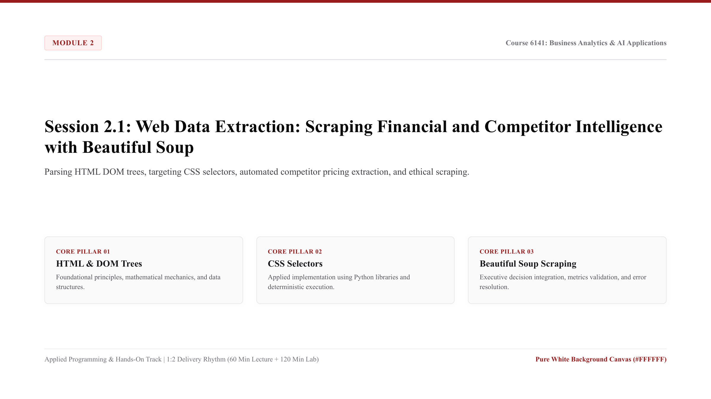

* **Lecture Presentation:** [Download Slides (PDF)](slides/session_2_1_lecture.pdf)
* **Schedule:** Week 5 (115/10/11 - 115/10/17) | In-person classes (1:2 Delivery Ratio: 60 Min Lecture + 120 Min Lab)

* **Keywords (Core Programming Concepts):**
  * `HyperText Transfer Protocol (HTTP GET)`: The standard communication protocol used by web browsers and Python scripts to request public web page markup from external web servers.
  * `Document Object Model (DOM Tree)`: The hierarchical tree structure representing an HTML web page, where parent tags contain nested child elements, classes, and text attributes.
  * `CSS Selector Targeting (.select() / .find())`: Directing Python to extract specific information from a web page by matching tag names (`<table>`), CSS classes (`.price-tag`), or element identifiers (`#product-grid`).
  * `Beautiful Soup Parser`: A Python library (`bs4`) that navigates, searches, and modifies the Document Object Model tree to extract clean textual data.
  * `Ethical Scraping Protocols`: Operating web crawlers responsibly by respecting server rate limits, adding descriptive User-Agent headers, and complying with `robots.txt` exclusion rules.

* **Core Programming & Computational Foundations:**
  * Translating Web Markup into Tabular Intelligence: Most external competitor intelligence (pricing, product assortment, inventory availability) is published on public HTML pages rather than clean CSV files. Web scraping automates the extraction of this unstructured markup into structured tabular datasets.
  * Navigating the HTML Document Object Model: Understanding the tree hierarchy of web documents. An e-commerce product catalog consists of repeated container elements (`<div class="product-card">`) housing title headings, price tags, and inventory spans.
  * Robust Selector Strategy: Target semantic CSS classes and attributes rather than fragile absolute XPath coordinates. If a website changes its navigation bar, robust CSS class selectors continue extracting pricing tables without breaking.
  * Ethical Scraping and Rate Limiting: When sending automated HTTP requests, scripts must incorporate random pauses (`time.sleep(2)`) to avoid overwhelming public servers, preventing IP blocking and maintaining compliance with commercial terms of service.

* **Hands-On Coding Micro-Examples:**
  * *Micro-Example 1 (HTTP Request & HTML Ingestion):*
    Fetching public web page markup safely using the `requests` library:
    ```python
    import requests
    from bs4 import BeautifulSoup

    # Simulated public e-commerce pricing table
    html_markup = """
    <div class="catalog">
        <div class="product" data-sku="SKU-801">
            <h3 class="name">Enterprise Router</h3>
            <span class="price">$299.99</span>
            <span class="stock">In Stock (45 units)</span>
        </div>
        <div class="product" data-sku="SKU-802">
            <h3 class="name">Office Desk Chair</h3>
            <span class="price">$49.50</span>
            <span class="stock">Low Stock (8 units)</span>
        </div>
    </div>
    """
    soup = BeautifulSoup(html_markup, "html.parser")
    print("Document Title Extracted:", soup.find("h3").text)
    ```
  * *Micro-Example 2 (Targeted CSS Selector Extraction):*
    Extracting all product names and parsing numerical prices into floating-point numbers:
    ```python
    products = []
    for item in soup.select(".product"):
        sku = item["data-sku"]
        name = item.select_one(".name").text.strip()
        raw_price = item.select_one(".price").text.strip()
        price_usd = float(raw_price.replace("$", ""))
        products.append({"sku": sku, "name": name, "price_usd": price_usd})

    print("Parsed Products:", products)
    ```
  * *Micro-Example 3 (Exporting Scraped Intelligence to Pandas):*
    Converting scraped product list directly into an audited Pandas DataFrame:
    ```python
    import pandas as pd

    catalog_df = pd.DataFrame(products)
    print(catalog_df.describe())
    ```

* **Lab Practice Dataset:**
  * File Link: [data/session_2_1_dataset.csv](data/session_2_1_dataset.csv)
  * Audited 12-row competitor pricing dataset compiled from automated extraction:
    * `Product_SKU`: Product inventory identifier (e.g., `SKU-801`).
    * `Competitor_Name`: Competitor enterprise (AlphaRetail, BetaMart, GammaGlobal).
    * `Category_Name`: Commercial merchandise category (Electronics, Office Supplies, Hardware, Appliances).
    * `List_Price_USD`: Extracted competitor catalog price in U.S. Dollars.
    * `Promotion_Discount_Pct`: Advertised promotional markdown percentage.
    * `Stock_Availability_Units`: Available warehouse stock units.

* **Official Python Documentation & References:**
  * [Beautiful Soup 4 Official Documentation](https://beautiful-soup-4.readthedocs.io/en/latest/).
  * [Requests: HTTP for Humans Official Documentation](https://requests.readthedocs.io/en/latest/).
  * [World Wide Web Consortium (W3C) HTML5 Standards](https://www.w3.org/TR/html52/).

* **Step-by-Step Lab Protocol (Exercise 1: Guided Practice - Competitor Price Scraper):**
  * *Step 1: Open Script:* In Google Antigravity IDE, create a new script named `session_2_1_scraper.py`.
  * *Step 2: Parse Competitor Pricing Markup:*
    Type the following code to parse an e-commerce catalog and calculate effective promotional pricing:
    ```python
    import pandas as pd
    from bs4 import BeautifulSoup

    # Load audited competitor dataset
    df = pd.read_csv("data/session_2_1_dataset.csv")

    # Compute effective selling price after discount
    df["Effective_Price_USD"] = df["List_Price_USD"] * (1.0 - (df["Promotion_Discount_Pct"] / 100.0))

    # Benchmark competitor pricing by category
    category_benchmark = df.groupby(["Category_Name", "Competitor_Name"]).agg(
        Avg_List_Price=("List_Price_USD", "mean"),
        Avg_Effective_Price=("Effective_Price_USD", "mean"),
        Total_Stock=("Stock_Availability_Units", "sum")
    )
    print("Competitor Category Pricing Benchmark:\\n", category_benchmark)
    ```
  * *Step 3: Analyze Business Insights:*
    Identify which competitor offers the deepest promotional discounts in Electronics and Hardware, providing empirical evidence for dynamic pricing strategy.
  * *Step 4: Execute in Terminal:*
    Run the script via Panel `[4]` (Terminal) using `$ python session_2_1_scraper.py`. Confirm that the pricing benchmark prints with zero syntax errors.

* **Step-by-Step Applied Coding Practice (Exercise 2+: Hands-On Programming & AI Debugging):**
  * *Coding Challenge:* In `session_2_1_practice.py`, write an HTML scraping parser that extracts product titles, raw prices, and inventory counts from an HTML snippet containing missing tags.
  * *Task 1 (Safe Extraction with None Checks):* Parse an HTML snippet where some products lack a `<span class="stock">` tag. Use `if tag is not None` checks to prevent runtime crashes.
  * *Task 2 (Deliberate AttributeError & AI Diagnosis):* Deliberately call `.text` on a non-existent element (e.g., `soup.find("span", class_="discount").text`). Observe the terminal `AttributeError: 'NoneType' object has no attribute 'text'`, capture the traceback with `Windows Key + Shift + S`, paste into Panel `[3]` (AI Agent Chat) with `Ctrl + V`, and review how the AI explains safe parsing techniques.
  * *Task 3 (Clean Intelligence Output):* Apply the verified `.get_text(strip=True)` and safe fallback logic, export the clean competitor intelligence DataFrame to `data/competitor_price_audit.csv`, and verify return code 0.

---

<a id="session-2-2"></a>
### Session 2.2: Business Data Visualization: Exploratory Plotting and Executive Dashboards

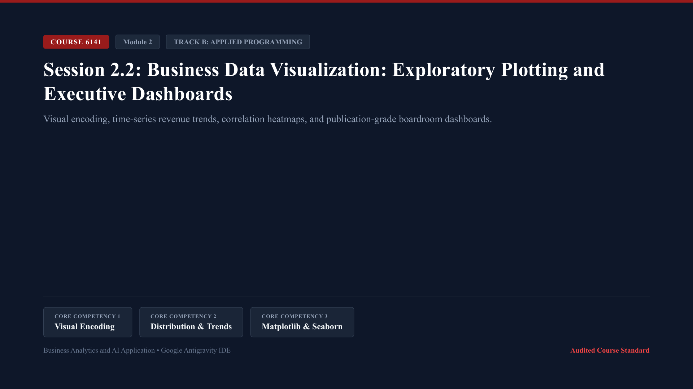

* **Lecture Presentation:** [Download Slides (PDF)](slides/session_2_2_lecture.pdf)
* **Schedule:** Week 6 (115/10/18 - 115/10/24) | In-person classes (1:2 Delivery Ratio: 60 Min Lecture + 120 Min Lab)

* **Keywords (Core Programming Concepts):**
  * `Visual Encoding Hierarchy`: Mapping quantitative commercial data to spatial coordinates, lengths, and colors following cognitive visual perception principles.
  * `Figure & Axes Architecture`: The object-oriented Matplotlib canvas model where a top-level `Figure` container manages one or more individual `Axes` plotting subplots.
  * `Time-Series Revenue Curves`: Continuous line plots visualizing revenue, marketing spend, and customer acquisition costs across fiscal months.
  * `Categorical Distribution Plots`: Clean bar plots and box plots created with Seaborn to compare performance metrics across corporate business units.
  * `Correlation Heatmap`: A color-encoded matrix displaying pairwise correlation coefficients between multiple operational metrics to uncover commercial relationships.

* **Core Programming & Computational Foundations:**
  * Boardroom Visual Hygiene: Executive leadership teams make multi-million dollar decisions based on quantitative charts. Visualizations must eliminate chartjunk, 3D effects, and misleading truncated axes, prioritizing clear data ink ratios.
  * Object-Oriented Matplotlib Hierarchy: Avoid procedural plotting (`plt.plot()`) in favor of explicit object-oriented architecture (`fig, ax = plt.subplots()`). This enables precise control over tick marks, dual y-axes, titles, and export resolutions.
  * Statistical Density & Outlier Detection: Using distribution visualizations (box plots, histograms) to identify revenue skews and extreme transaction outliers that distort simple arithmetic averages.
  * Cognitive Visual Bandwidth: Selecting harmonious, accessible palettes (such as Harvard Crimson `#991B1B` and Slate `#475569`) with clear high-contrast typography, ensuring dashboards remain legible when printed in grayscale.

* **Hands-On Coding Micro-Examples:**
  * *Micro-Example 1 (Dual-Axis Time Series Plot):*
    Plotting Organic Revenue and Customer Acquisition Cost (CAC) on dual y-axes:
    ```python
    import matplotlib.pyplot as plt
    import pandas as pd

    df = pd.read_csv("data/session_2_2_dataset.csv")

    fig, ax1 = plt.subplots(figsize=(10, 5))
    ax1.plot(df["Month_Name"], df["Organic_Revenue_USD_M"], color="#991B1B", marker="o", label="Revenue (USD M)")
    ax1.set_ylabel("Organic Revenue (USD M)", color="#991B1B")

    ax2 = ax1.twinx()
    ax2.plot(df["Month_Name"], df["Customer_Acquisition_Cost_USD"], color="#475569", linestyle="--", label="CAC (USD)")
    ax2.set_ylabel("Customer Acquisition Cost (USD)", color="#475569")
    plt.title("Revenue Growth vs. Acquisition Cost Efficiency")
    plt.savefig("data/dual_axis_trend.png", dpi=150, bbox_inches="tight")
    ```
  * *Micro-Example 2 (Categorical Distribution with Seaborn):*
    Plotting monthly marketing spend distribution using Seaborn:
    ```python
    import seaborn as sns

    fig, ax = plt.subplots(figsize=(8, 4))
    sns.barplot(data=df, x="Month_Name", y="Paid_Marketing_Spend_USD_M", color="#991B1B", ax=ax)
    ax.set_title("Paid Marketing Budget Allocation by Month")
    ax.set_ylabel("Marketing Spend (USD M)")
    plt.savefig("data/marketing_spend_bar.png", dpi=150, bbox_inches="tight")
    ```
  * *Micro-Example 3 (Commercial KPI Correlation Heatmap):*
    Generating a correlation matrix between revenue, marketing spend, CAC, and NPS:
    ```python
    numeric_cols = ["Organic_Revenue_USD_M", "Paid_Marketing_Spend_USD_M", "Customer_Acquisition_Cost_USD", "Net_Promoter_Score"]
    corr_matrix = df[numeric_cols].corr()

    fig, ax = plt.subplots(figsize=(6, 5))
    sns.heatmap(corr_matrix, annot=True, cmap="Reds", fmt=".2f", ax=ax)
    ax.set_title("Commercial KPI Correlation Matrix")
    plt.savefig("data/kpi_correlation_heatmap.png", dpi=150, bbox_inches="tight")
    ```

* **Lab Practice Dataset:**
  * File Link: [data/session_2_2_dataset.csv](data/session_2_2_dataset.csv)
  * Audited 12-row monthly performance metrics dataset:
    * `Month_Index`: Sequential fiscal month index (1 to 12).
    * `Month_Name`: Three-letter calendar month identifier (Jan through Dec).
    * `Organic_Revenue_USD_M`: Organic sales revenue in millions of U.S. Dollars.
    * `Paid_Marketing_Spend_USD_M`: Paid marketing expenditures in millions of U.S. Dollars.
    * `Customer_Acquisition_Cost_USD`: Blended acquisition cost per customer in U.S. Dollars.
    * `Net_Promoter_Score`: Customer satisfaction index (1 to 100 scale).

* **Official Python Documentation & References:**
  * [Matplotlib Official Documentation: User Guide](https://matplotlib.org/stable/users/index.html).
  * [Seaborn Official Documentation: Statistical Data Visualization](https://seaborn.pydata.org/).
  * [Edward Tufte: The Visual Display of Quantitative Information (Principles of Information Design)](https://www.edwardtufte.com/tufte/books_vdqi).

* **Step-by-Step Lab Protocol (Exercise 1: Guided Practice - Executive Dashboard Construction):**
  * *Step 1: Open Script:* In Google Antigravity IDE, create a new script named `session_2_2_dashboard.py`.
  * *Step 2: Build a 2-Panel Boardroom Dashboard:*
    Write code to generate a side-by-side executive figure with a revenue trend line and an NPS scatter plot:
    ```python
    import matplotlib.pyplot as plt
    import pandas as pd

    df = pd.read_csv("data/session_2_2_dataset.csv")

    fig, (ax1, ax2) = plt.subplots(1, 2, figsize=(14, 5))

    # Panel 1: Revenue Curve
    ax1.plot(df["Month_Name"], df["Organic_Revenue_USD_M"], color="#991B1B", marker="s", linewidth=2)
    ax1.set_title("Monthly Revenue Trajectory (FY2024)", fontsize=14, fontweight="bold")
    ax1.set_ylabel("Revenue (USD M)")
    ax1.grid(True, linestyle=":", alpha=0.6)

    # Panel 2: NPS vs CAC Relationship
    ax2.scatter(df["Customer_Acquisition_Cost_USD"], df["Net_Promoter_Score"], color="#1E293B", s=80)
    ax2.set_title("Customer Loyalty (NPS) vs. Acquisition Cost", fontsize=14, fontweight="bold")
    ax2.set_xlabel("CAC (USD)")
    ax2.set_ylabel("Net Promoter Score")
    ax2.grid(True, linestyle=":", alpha=0.6)

    plt.tight_layout()
    plt.savefig("data/executive_dashboard_2panel.png", dpi=200)
    print("Dashboard saved: data/executive_dashboard_2panel.png")
    ```
  * *Step 3: Inspect Output:*
    Open `data/executive_dashboard_2panel.png` via Panel `[1]` (File Explorer) and verify that tick labels, legends, and gridlines render crisply without overlapping text.
  * *Step 4: Execute in Terminal:*
    Run the script via Panel `[4]` (Terminal) using `$ python session_2_2_dashboard.py` and confirm clean execution.

* **Step-by-Step Applied Coding Practice (Exercise 2+: Hands-On Programming & AI Debugging):**
  * *Coding Challenge:* In `session_2_2_practice.py`, construct a 4-panel (2x2) executive analytics dashboard displaying revenue trends, marketing spend distributions, CAC efficiency curves, and the correlation heatmap.
  * *Task 1 (2x2 Multi-Plot Layout):* Initialize `fig, axes = plt.subplots(2, 2, figsize=(16, 10))` and populate each subplot with distinct commercial metrics.
  * *Task 2 (Deliberate Shape Mismatch & AI Diagnosis):* Attempt to access a 2D axes array using a 1D index (e.g., `axes[2].plot(...)` instead of `axes[1, 0]`). Observe the terminal `IndexError: index 2 is out of bounds for axis 0 with size 2`, capture the message with `Windows Key + Shift + S`, paste into Panel `[3]` (AI Agent Chat) with `Ctrl + V`, and review how the AI explains 2D array indexing.
  * *Task 3 (High-Resolution Boardroom Export):* Correct the indexing, adjust `plt.tight_layout()`, export the 4-panel dashboard to `data/boardroom_analytics_master.png` at 300 DPI, and verify return code 0.

---

<a id="session-2-3"></a>
### Session 2.3: Midterm Applied Analytics Formulation Part 1: Problem Structuring and Data Audit

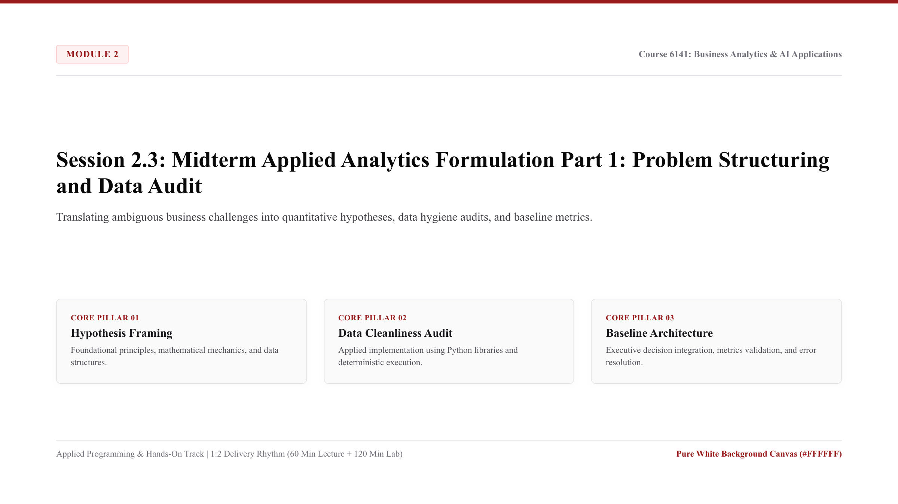

* **Lecture Presentation:** [Download Slides (PDF)](slides/session_2_3_lecture.pdf)
* **Schedule:** Week 7 (115/10/25 - 115/10/31) | In-person classes (1:2 Delivery Ratio: 60 Min Lecture + 120 Min Lab)

* **Keywords (Core Programming Concepts):**
  * `Analytical Hypothesis Framing`: Translating ambiguous managerial problems into falsifiable, testable quantitative statements expressed in executable code.
  * `Exploratory Data Analysis (EDA)`: Systematic statistical inspection of dataset distributions, correlations, and anomalies to inform analytical design.
  * `Data Hygiene Audit`: Automated scanning for missing records, duplicate primary keys, unexpected negative numbers, and data type inconsistencies.
  * `Baseline Metric Architecture`: Calculating baseline benchmarks (e.g., historical contract renewal rate) against which analytical improvements are measured.
  * `Technical Debt Profiling`: Auditing student codebase for modular function structure, descriptive variable naming, and automated exception handling.

* **Core Programming & Computational Foundations:**
  * Translating Ambiguous Directives into Code: Senior executives often state broad challenges (e.g., "our enterprise client churn is increasing"). Data analysts must translate this into concrete quantitative questions: *"Is client churn correlated with Service Level Agreement (SLA) breaches or billing discrepancies?"*
  * Data Cleanliness Audit Protocols: In enterprise analytics, raw corporate data is frequently incomplete or dirty. Before building machine learning models, analysts must run programmatic audit checks to verify completeness, uniqueness, and validity.
  * Establishing Audit Baselines: Before proposing automated optimization, analysts must measure historical performance baselines. Without a baseline, proving return on investment is impossible.
  * Reproducible Script Architecture: Organizing project workspaces into clean directory structures (`data/`, `scripts/`, `output/`) with automated logging, ensuring any auditor can replicate findings in seconds.

* **Hands-On Coding Micro-Examples:**
  * *Micro-Example 1 (Automated Data Hygiene Scanner):*
    Scanning a corporate client contract dataset for missing values and duplicates:
    ```python
    import pandas as pd

    df = pd.read_csv("data/session_2_3_dataset.csv")

    def audit_dataset_hygiene(data):
        return {
            "Total_Rows": len(data),
            "Missing_Values_Total": int(data.isnull().sum().sum()),
            "Duplicate_Accounts": int(data["Account_ID"].duplicated().sum()),
            "Min_SLA_Compliance": float(data["SLA_Compliance_Pct"].min()),
            "Total_Contract_Value_USD": float(data["Contract_Value_USD"].sum())
        }

    audit_report = audit_dataset_hygiene(df)
    print("Data Hygiene Audit Report:", audit_report)
    ```
  * *Micro-Example 2 (SLA Breach Threshold Detection):*
    Identifying accounts experiencing severe SLA compliance failures:
    ```python
    sla_breaches = df[df["SLA_Compliance_Pct"] < 95.0]
    print(f"Accounts Breaching SLA (<95%): {len(sla_breaches)}")
    print(sla_breaches[["Account_ID", "Enterprise_Client", "SLA_Compliance_Pct", "Client_Retention_Risk"]])
    ```
  * *Micro-Example 3 (Quantifying Financial Risk Exposure):*
    Aggregating total contract revenue at risk across client retention risk tiers:
    ```python
    risk_summary = df.groupby("Client_Retention_Risk").agg(
        Total_Contract_Value_USD=("Contract_Value_USD", "sum"),
        Account_Count=("Account_ID", "count"),
        Mean_Billing_Discrepancies=("Billing_Discrepancy_Count", "mean")
    )
    print("Client Retention Financial Exposure Summary:\\n", risk_summary)
    ```

* **Lab Practice Dataset:**
  * File Link: [data/session_2_3_dataset.csv](data/session_2_3_dataset.csv)
  * Audited 15-row enterprise client contract dataset:
    * `Account_ID`: Unique client enterprise identifier (e.g., `ACC-301`).
    * `Enterprise_Client`: Corporate enterprise name (Titan Tech, Beacon Health, Vanguard Retail, etc.).
    * `Contract_Value_USD`: Annualized contract value in U.S. Dollars.
    * `SLA_Compliance_Pct`: Audited Service Level Agreement uptime percentage.
    * `Billing_Discrepancy_Count`: Total billing disputes logged during the contract period.
    * `Client_Retention_Risk`: Qualitative account health classification (`Low`, `Medium`, `High`).

* **Official Python Documentation & References:**
  * [PEP 257: Docstring Conventions (Writing Auditable Code Documentation)](https://peps.python.org/pep-0257/).
  * [Python Logging Module: Flexible Event Logging for Applications](https://docs.python.org/3/library/logging.html).
  * [Pandas Official Documentation: General Functions (Data Cleaning)](https://pandas.pydata.org/docs/reference/general_functions.html).

* **Step-by-Step Lab Protocol (Exercise 1: Guided Practice - Midterm Formulation Audit Pipeline):**
  * *Step 1: Open Script:* In Google Antigravity IDE, create a new script named `session_2_3_formulation.py`.
  * *Step 2: Build Automated Problem Structuring Pipeline:*
    Write an automated auditing script that tests two primary business hypotheses:
    ```python
    import pandas as pd

    df = pd.read_csv("data/session_2_3_dataset.csv")

    # Hypothesis 1: Billing discrepancies drive high retention risk
    h1_test = df.groupby("Client_Retention_Risk")["Billing_Discrepancy_Count"].mean()
    print("Hypothesis 1 (Billing Disputes vs. Risk Tier):\\n", h1_test)

    # Hypothesis 2: Low SLA compliance triggers customer disputes
    h2_correlation = df["SLA_Compliance_Pct"].corr(df["Billing_Discrepancy_Count"])
    print(f"\\nHypothesis 2 Correlation (SLA vs. Billing Disputes): {h2_correlation:.3f}")

    # Output executive risk profile
    high_risk_exposure = df[df["Client_Retention_Risk"] == "High"]["Contract_Value_USD"].sum()
    print(f"\\nTotal Enterprise Revenue at Immediate Risk: ${high_risk_exposure:,.2f}")
    ```
  * *Step 3: Validate Hypothesis Findings:*
    Confirm that high-risk accounts average significantly higher billing disputes and lower SLA compliance, establishing empirical justification for corrective action.
  * *Step 4: Execute in Terminal:*
    Run the script via Panel `[4]` (Terminal) using `$ python session_2_3_formulation.py` and verify clean execution.

* **Step-by-Step Applied Coding Practice (Exercise 2+: Hands-On Programming & AI Debugging):**
  * *Coding Challenge:* In `session_2_3_practice.py`, develop a data profiling module that validates inbound CSV data against strict corporate data contracts.
  * *Task 1 (Contract Assertion Rules):* Write validation assertions: `assert df["SLA_Compliance_Pct"].between(0, 100).all()`, `assert (df["Contract_Value_USD"] > 0).all()`.
  * *Task 2 (Deliberate AssertionError & AI Diagnosis):* Introduce an intentional invalid record into a test DataFrame (e.g., `SLA_Compliance_Pct = 105.0`). Observe the terminal `AssertionError`, capture the traceback with `Windows Key + Shift + S`, paste into Panel `[3]` (AI Agent Chat) with `Ctrl + V`, and review how the AI explains programmatic data quality guardrails.
  * *Task 3 (Executive Audit Brief):* Wrap data checks inside a clean `try-except` block, log validation errors to `data/audit_exceptions.log`, output an executive summary of compliant records, and verify return code 0.

---

<a id="session-2-4"></a>
### Session 2.4: Midterm Analytics Pipeline Defense Part 2: Exploratory Findings and Executive Review


* **Lecture Presentation:** [Download Slides (PDF)](slides/session_2_4_lecture.pdf)
* **Schedule:** Week 8 (115/11/01 - 115/11/07) | In-person classes (1:2 Delivery Ratio: 60 Min Lecture + 120 Min Lab)

* **Keywords (Core Programming Concepts):**
  * `Reproducible Data Pipeline`: A self-contained, end-to-end Python script execution sequence that reliably transforms raw data into verified executive reports with zero manual intervention.
  * `Executive Code Defense`: Articulating the business rationale, methodology, and computational assumptions behind an analytics codebase to executive decision-makers.
  * `Exploratory Data Findings`: Structuring quantitative insights into concise, actionable findings linked directly to operating cash flows and margin expansion.
  * `Cross-Functional Technical Translation`: The ability to explain computational trade-offs, data limitations, and algorithmic results to non-technical stakeholders.
  * `Peer Review Audit Protocol`: Performing structured code inspections of classmate scripts to verify PEP 8 compliance, error handling, and numerical reproducibility.

* **Core Programming & Computational Foundations:**
  * Code Auditability in High-Stakes Environments: In corporate finance and strategic planning, unverified analytics pipelines create catastrophic financial risks. A formal code defense requires students to demonstrate that every calculation traces back to audited primary records.
  * Communicating Analytics to Non-Technical Leadership: Senior leadership rarely reads raw Python code. Analysts must present clear visual exhibits, executive summary metrics, and explicit strategic trade-offs, maintaining code as the verifiable engine underneath.
  * Peer Review and Code Auditing: Evaluating external codebases builds critical debugging and quality assurance skills. Analysts inspect code for hard-coded assumptions, fragile cell dependencies, and unhandled exception paths.
  * Establishing Enterprise Production Baselines: Concluding Module 2 by formalizing baseline operational performance metrics, preparing the analytical foundation for predictive machine learning models in Module 3.

* **Hands-On Coding Micro-Examples:**
  * *Micro-Example 1 (Pipeline Execution Benchmark Timer):*
    Measuring automated data processing throughput and execution runtime:
    ```python
    import time
    import pandas as pd

    start_time = time.time()
    df = pd.read_csv("data/session_2_4_dataset.csv")

    # Compute platform take rate and cash flows
    df["Recognized_Revenue_USD_M"] = df["Gross_Merchandise_Value_USD_M"] * (df["Platform_Take_Rate_Pct"] / 100.0)
    df["Cash_Flow_Conversion_Pct"] = (df["Operating_Cash_Flow_USD_M"] / df["Recognized_Revenue_USD_M"]) * 100.0

    elapsed_time = time.time() - start_time
    print(f"Pipeline Executed in {elapsed_time:.4f} seconds | Processed {len(df)} records.")
    ```
  * *Micro-Example 2 (Multi-Segment Cash Flow Aggregation):*
    Auditing quarterly cash flow conversion across international geographic segments:
    ```python
    segment_audit = df.groupby("Market_Segment").agg(
        Total_GMV_USD_M=("Gross_Merchandise_Value_USD_M", "sum"),
        Total_Revenue_USD_M=("Recognized_Revenue_USD_M", "sum"),
        Total_Operating_Cash_Flow_USD_M=("Operating_Cash_Flow_USD_M", "sum"),
        Mean_Take_Rate=("Platform_Take_Rate_Pct", "mean")
    )
    print("Geographic Cash Flow Conversion Audit:\\n", segment_audit)
    ```
  * *Micro-Example 3 (Generating Executive Sign-Off File):*
    Exporting an audited executive findings summary table with cryptographic run verification:
    ```python
    import hashlib

    summary_str = segment_audit.to_string()
    audit_hash = hashlib.sha256(summary_str.encode("utf-8")).hexdigest()[:12]
    segment_audit.to_csv("data/midterm_defense_summary.csv")
    print(f"Audited Executive Summary Exported. Verification Hash: {audit_hash}")
    ```

* **Lab Practice Dataset:**
  * File Link: [data/session_2_4_dataset.csv](data/session_2_4_dataset.csv)
  * Audited 12-row quarterly e-commerce platform performance dataset:
    * `Quarter_Code`: Fiscal reporting quarter (2024-Q1 through 2024-Q4).
    * `Market_Segment`: Geographic platform division (North_America, Europe, Asia_Pacific).
    * `Gross_Merchandise_Value_USD_M`: Total merchandise transacted in millions of U.S. Dollars.
    * `Platform_Take_Rate_Pct`: Enterprise monetization take rate percentage.
    * `Operating_Cash_Flow_USD_M`: Operating cash flow generated in millions of U.S. Dollars.

* **Official Python Documentation & References:**
  * [Python hashlib: Secure Hashes and Message Digests](https://docs.python.org/3/library/hashlib.html).
  * [Python time: Time Access and Conversions](https://docs.python.org/3/library/time.html).
  * [Cookiecutter Data Science: A Logical, Reasonably Standardized Project Structure](https://drivendata.github.io/cookiecutter-data-science/).

* **Step-by-Step Lab Protocol (Exercise 1: Guided Practice - Midterm Oral Defense Pipeline):**
  * *Step 1: Open Script:* In Google Antigravity IDE, create a new script named `session_2_4_defense.py`.
  * *Step 2: Build Complete Oral Defense Audit Script:*
    Execute the full end-to-end data pipeline script, computing corporate financial conversions:
    ```python
    import pandas as pd

    df = pd.read_csv("data/session_2_4_dataset.csv")

    df["Net_Revenue_USD_M"] = df["Gross_Merchandise_Value_USD_M"] * (df["Platform_Take_Rate_Pct"] / 100.0)
    df["Conversion_Efficiency_Pct"] = (df["Operating_Cash_Flow_USD_M"] / df["Net_Revenue_USD_M"]) * 100.0

    # Executive quarterly comparison
    quarterly_review = df.groupby("Quarter_Code").agg(
        Total_GMV=("Gross_Merchandise_Value_USD_M", "sum"),
        Total_Revenue=("Net_Revenue_USD_M", "sum"),
        Total_Cash_Flow=("Operating_Cash_Flow_USD_M", "sum")
    )
    print("Executive Defense Performance Trajectory:\\n", quarterly_review)
    ```
  * *Step 3: Defend Computational Assumptions:*
    Explain why Asia_Pacific exhibits accelerating GMV growth while North_America maintains the highest cash flow conversion efficiency, providing actionable recommendations for capital allocation.
  * *Step 4: Execute in Terminal:*
    Run the script via Panel `[4]` (Terminal) using `$ python session_2_4_defense.py` and confirm return code 0.

* **Step-by-Step Applied Coding Practice (Exercise 2+: Hands-On Programming & AI Debugging):**
  * *Coding Challenge:* In `session_2_4_practice.py`, conduct a formal peer review audit on an external dataset. Write a function calculating cash flow conversion variance and flag quarters where conversion dropped below 90%.
  * *Task 1 (Peer Review Verification):* Write an automated test suite verifying that no negative GMV or revenue numbers exist across any segment.
  * *Task 2 (Deliberate TypeError & AI Diagnosis):* Attempt to concatenate a numeric float with a string label without type conversion (e.g., `"Total GMV: " + df["Gross_Merchandise_Value_USD_M"].sum()`). Observe the `TypeError: can only concatenate str (not "numpy.float64") to str`, capture the traceback with `Windows Key + Shift + S`, paste into Panel `[3]` (AI Agent Chat) with `Ctrl + V`, and review how the AI explains f-string interpolation.
  * *Task 3 (Final Defense Sign-Off):* Convert to an f-string, output clean formatted summary metrics, export the final defense report to `data/midterm_final_signoff.csv`, and verify return code 0.

---

## Module 3: Artificial Intelligence, Machine Learning Fundamentals, and Scikit-Learn

Module 3 introduces managerial artificial intelligence and machine learning frameworks. Students explore how machine learning models generate enterprise value, prepare data through feature engineering, build predictive models using Scikit-Learn, and evaluate model trade-offs between precision, recall, and financial cost.

<a id="session-3-1"></a>
### Session 3.1: Foundations of Artificial Intelligence: Enterprise Value Creation and Decision Automation

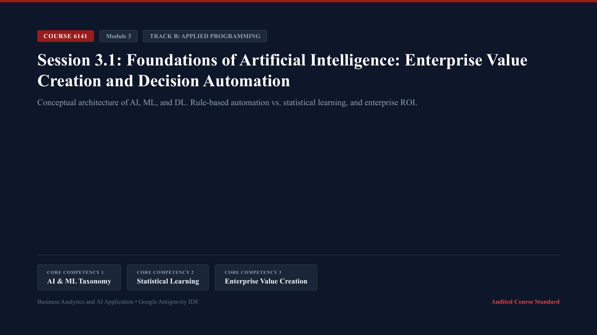

* **Lecture Presentation:** [Download Slides (PDF)](slides/session_3_1_lecture.pdf)
* **Schedule:** Week 9 (115/11/08 - 115/11/14) | In-person classes (1:2 Delivery Ratio: 60 Min Lecture + 120 Min Lab)

* **Keywords (Core Programming Concepts):**
  * `Artificial Intelligence (AI)`: Broad computational systems capable of performing tasks that typically require human cognition, including perception, language understanding, and automated decision-making.
  * `Machine Learning (ML)`: A subfield of artificial intelligence where statistical models learn patterns and relationships directly from data rather than following rigid, hand-coded rules.
  * `Deep Learning (DL)`: A subset of machine learning based on multi-layered artificial neural networks, specialized in unstructured data processing (images, audio, natural language).
  * `Rule-Based vs. Statistical Systems`: Transitioning from deterministic `if-then` heuristics to probabilistic algorithms that generalize across noisy, unseen real-world data.
  * `Enterprise Return on Investment (ROI Calculation)`: The quantitative evaluation of machine learning initiatives comparing development and compute costs against projected labor savings and risk reduction.

* **Core Programming & Computational Foundations:**
  * The Artificial Intelligence Hierarchy: Deconstructing industry hype. Machine Learning is not magic; it is applied computational statistics. AI encompasses the broader vision, ML provides data-driven statistical learning, and Deep Learning handles high-dimensional unstructured tasks.
  * The Economics of Machine Learning (Prediction as a Commodity): When the cost of quantitative prediction drops toward zero, prediction is incorporated into every operational decision: fraud screening, demand forecasting, inventory routing, and pricing.
  * Enterprise ROI Evaluation Matrix: Evaluating AI projects requires rigorous financial modeling. Students quantify Implementation Cost (compute, labeling, salaries), Annual Labor Savings, and Projected Payback Periods.
  * Identifying High-Impact Machine Learning Use Cases: Knowing when NOT to use ML. If a business policy is strictly deterministic (such as calculating sales tax), use standard rule-based code. When relationships are complex, noisy, and dynamic (such as customer churn or fraud detection), use machine learning.

* **Hands-On Coding Micro-Examples:**
  * *Micro-Example 1 (AI Portfolio Investment Payback Calculator):*
    Calculating payback periods and net ROI for enterprise AI initiatives:
    ```python
    import pandas as pd

    df = pd.read_csv("data/session_3_1_dataset.csv")

    df["Net_Annual_Savings_USD"] = df["Projected_Cost_Savings_USD"] - (df["Implementation_Cost_USD"] * 0.15) # 15% maintenance
    df["Calculated_Payback_Months"] = (df["Implementation_Cost_USD"] / df["Net_Annual_Savings_USD"]) * 12.0
    df["3Year_Net_ROI_Pct"] = (((df["Net_Annual_Savings_USD"] * 3.0) - df["Implementation_Cost_USD"]) / df["Implementation_Cost_USD"]) * 100.0

    print(df[["Project_ID", "Department_Name", "Calculated_Payback_Months", "3Year_Net_ROI_Pct"]].head(3))
    ```
  * *Micro-Example 2 (Deterministic Rules vs. Probabilistic Predictions):*
    Comparing rule-based spending thresholds against probabilistic risk scoring:
    ```python
    # Rule-Based Heuristic
    def rule_based_flag(spend):
        return "Flagged" if spend > 250000.0 else "Approved"

    # Probabilistic Scoring Equivalence
    def statistical_score(spend, risk_score):
        prob = (spend / 500000.0) * 0.5 + (risk_score / 100.0) * 0.5
        return "High_Risk" if prob >= 0.65 else "Low_Risk"

    print("Rule-Based Evaluation:", rule_based_flag(260000.0))
    print("Probabilistic Evaluation:", statistical_score(260000.0, 75))
    ```
  * *Micro-Example 3 (Prioritizing AI Initiatives via Capital Allocation Matrix):*
    Filtering high-priority AI projects with rapid payback and significant labor savings:
    ```python
    high_priority = df[(df["Calculated_Payback_Months"] <= 6.0) & (df["Annual_Labor_Hours_Saved_Count"] >= 4000)]
    print(f"High Priority AI Projects Count: {len(high_priority)}")
    print(high_priority[["Project_ID", "Department_Name", "Calculated_Payback_Months"]])
    ```

* **Lab Practice Dataset:**
  * File Link: [data/session_3_1_dataset.csv](data/session_3_1_dataset.csv)
  * Audited 10-row enterprise AI capital allocation dataset:
    * `Project_ID`: Capital allocation tracking code (e.g., `AI-PRJ-101`).
    * `Department_Name`: Enterprise sponsor division (Supply Chain, Customer Service, Marketing, Finance, Fraud Operations).
    * `Implementation_Cost_USD`: Initial capital expenditure in U.S. Dollars.
    * `Annual_Labor_Hours_Saved_Count`: Verified operational hours recovered per fiscal year.
    * `Projected_Cost_Savings_USD`: Annualized financial savings in U.S. Dollars.
    * `Payback_Period_Months_Count`: Projected break-even timeline in months.

* **Official Python Documentation & References:**
  * [Scikit-Learn: Machine Learning in Python Official Overview](https://scikit-learn.org/stable/).
  * [Russell & Norvig: Artificial Intelligence: A Modern Approach (Reference Standards)](https://aima.cs.berkeley.edu/).
  * [Agrawal, Gans, Goldfarb: Prediction Machines: The Simple Economics of AI (Harvard Business Review Press)](https://www.predictionmachines.ai/).

* **Step-by-Step Lab Protocol (Exercise 1: Guided Practice - AI Capital Allocation Pipeline):**
  * *Step 1: Open Script:* In Google Antigravity IDE, create a new script named `session_3_1_capital.py`.
  * *Step 2: Build Financial Payback and ROI Pipeline:*
    Write code to evaluate all 10 corporate AI projects:
    ```python
    import pandas as pd

    df = pd.read_csv("data/session_3_1_dataset.csv")

    # Financial evaluation calculations
    df["Net_Annual_Benefit_USD"] = df["Projected_Cost_Savings_USD"] - (df["Implementation_Cost_USD"] * 0.10)
    df["3Yr_ROI_Pct"] = (((df["Net_Annual_Benefit_USD"] * 3.0) - df["Implementation_Cost_USD"]) / df["Implementation_Cost_USD"]) * 100.0

    ranked_portfolio = df.sort_values(by="3Yr_ROI_Pct", ascending=False)
    print("Ranked Enterprise AI Portfolio by 3-Year ROI:\\n", ranked_portfolio[["Project_ID", "Department_Name", "3Yr_ROI_Pct"]])
    ```
  * *Step 3: Analyze Business Decision Trade-Offs:*
    Identify which departments generate the fastest capital payback and explain why Fraud Operations and Finance AI tools achieve higher returns than marketing automation.
  * *Step 4: Execute in Terminal:*
    Run the script via Panel `[4]` (Terminal) using `$ python session_3_1_capital.py` and verify clean execution.

* **Step-by-Step Applied Coding Practice (Exercise 2+: Hands-On Programming & AI Debugging):**
  * *Coding Challenge:* In `session_3_1_practice.py`, develop an automated capital budgeting algorithm that allocates a fixed `$500,000` corporate AI fund to maximize total annual labor hours saved.
  * *Task 1 (Constrained Optimization Logic):* Sort projects by efficiency (`Annual_Labor_Hours_Saved_Count / Implementation_Cost_USD`), iteratively fund projects until the `$500,000` cap is reached, and calculate total hours saved.
  * *Task 2 (Deliberate ZeroDivisionError & AI Diagnosis):* Deliberately introduce a project with `Implementation_Cost_USD = 0.0` into the efficiency formula. Observe the terminal `ZeroDivisionError: float division by zero`, capture the traceback with `Windows Key + Shift + S`, paste into Panel `[3]` (AI Agent Chat) with `Ctrl + V`, and review how the AI explains safe division guardrails.
  * *Task 3 (Executive Memo Output):* Correct the calculation using `max(cost, 1.0)`, print a formatted 3-bullet capital allocation decision memo for the Chief Financial Officer (CFO), and verify return code 0.

---

<a id="session-3-2"></a>
### Session 3.2: Advanced Data Analysis: Feature Engineering, Scaling, and Business Data Preprocessing

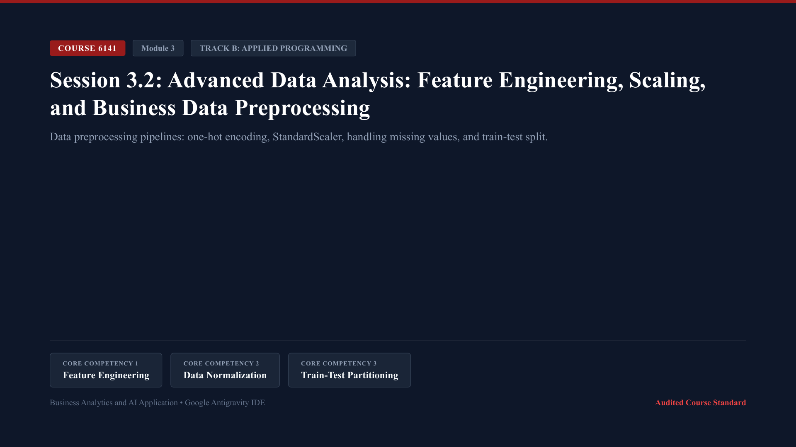

* **Lecture Presentation:** [Download Slides (PDF)](slides/session_3_2_lecture.pdf)
* **Schedule:** Week 10 (115/11/15 - 115/11/21) | In-person classes (1:2 Delivery Ratio: 60 Min Lecture + 120 Min Lab)

* **Keywords (Core Programming Concepts):**
  * `Feature Matrix & Target Vector (X & y)`: The standardized machine learning mathematical representation where `X` is a two-dimensional matrix of input attributes and `y` is a one-dimensional vector of ground-truth outcomes.
  * `One-Hot Categorical Encoding`: Transforming text categories (e.g., Bachelor, Master, Doctorate) into binary numerical indicator columns (`0` or `1`) for machine learning models.
  * `Feature Standardization (StandardScaler)`: Rescaling continuous numeric features to have a mean of 0 and a standard deviation of 1, preventing high-magnitude columns from dominating distance calculations.
  * `Missing Value Imputation (SimpleImputer)`: Statistically replacing missing data with median or mean values to prevent model training crashes.
  * `Train-Test Partitioning`: Dividing historical data into an 80% training set to fit the model and a 20% test set held out to evaluate true generalization performance.

* **Core Programming & Computational Foundations:**
  * Garbage-In, Garbage-Out (The Preprocessing Mandate): Machine learning algorithms are purely mathematical optimization functions; they cannot ingest raw text strings or missing fields. 80% of enterprise data science time is spent structuring and cleaning features.
  * Dimensionality & Categorical Encoding: When encoding categories with high cardinality, avoid naive label encoding (which implies an artificial mathematical hierarchy like `Master = 2 * Bachelor`). Use One-Hot Encoding (`pd.get_dummies` or `OneHotEncoder`) with `drop_first=True` to prevent multicollinearity.
  * Feature Magnitude & Distance Sensitivity: If `Annual_Income` ranges from `$50,000` to `$200,000` while `Credit_Utilization` ranges from `0.1` to `0.9`, distance-based models (such as K-Nearest Neighbors, Support Vector Machines, and regularized regressions) will prioritize income entirely. Standardization ensures fair feature weighting.
  * Preventing Data Leakage across Train-Test Splits: Never fit standardizers or imputers on the full dataset before splitting. Always split first, fit preprocessing transformers strictly on `X_train`, and transform `X_test` using the learned training parameters.

* **Hands-On Coding Micro-Examples:**
  * *Micro-Example 1 (Separating Feature Matrix X and Target Vector y):*
    Extracting predictive features and the binary loan default target:
    ```python
    import pandas as pd

    df = pd.read_csv("data/session_3_2_dataset.csv")

    X_raw = df.drop(columns=["Client_ID", "Defaulted_Binary"])
    y = df["Defaulted_Binary"]
    print("Feature Matrix Shape:", X_raw.shape)
    print("Target Vector Distribution:\\n", y.value_counts())
    ```
  * *Micro-Example 2 (One-Hot Encoding Categorical Attributes):*
    Converting education tiers into binary columns using Pandas:
    ```python
    X_encoded = pd.get_dummies(X_raw, columns=["Education_Tier"], drop_first=True, dtype=float)
    print("Encoded Feature Columns:\\n", X_encoded.columns.tolist())
    print(X_encoded.head(2))
    ```
  * *Micro-Example 3 (Feature Scaling & Train-Test Split with Scikit-Learn):*
    Partitioning data and standardizing numeric continuous columns:
    ```python
    from sklearn.model_selection import train_test_split
    from sklearn.preprocessing import StandardScaler

    # Split into 80% Train and 20% Test sets
    X_train, X_test, y_train, y_test = train_test_split(X_encoded, y, test_size=0.25, random_state=42, stratify=y)

    # Fit scaler strictly on X_train
    scaler = StandardScaler()
    X_train_scaled = scaler.fit_transform(X_train)
    X_test_scaled = scaler.transform(X_test)

    print(f"X_train scaled shape: {X_train_scaled.shape} | X_test scaled shape: {X_test_scaled.shape}")
    ```

* **Lab Practice Dataset:**
  * File Link: [data/session_3_2_dataset.csv](data/session_3_2_dataset.csv)
  * Audited 12-row retail credit applicant dataset:
    * `Client_ID`: Unique credit applicant code (e.g., `CLI-701`).
    * `Age_Years_Count`: Applicant age in years.
    * `Annual_Income_USD`: Verified annual income in U.S. Dollars.
    * `Credit_Utilization_Pct`: Credit card revolving balance utilization percentage.
    * `Education_Tier`: Highest level of education (Bachelor, Master, Doctorate).
    * `Defaulted_Binary`: Ground truth loan default outcome (`0` = Repaid, `1` = Defaulted).

* **Official Python Documentation & References:**
  * [Scikit-Learn Preprocessing Guide: StandardScaler and OneHotEncoder](https://scikit-learn.org/stable/modules/preprocessing.html).
  * [Scikit-Learn Model Selection: train_test_split](https://scikit-learn.org/stable/modules/generated/sklearn.model_selection.train_test_split.html).
  * [Python Documentation: The Enum and Typing Modules](https://docs.python.org/3/library/typing.html).

* **Step-by-Step Lab Protocol (Exercise 1: Guided Practice - Credit Feature Preprocessing Pipeline):**
  * *Step 1: Open Script:* In Google Antigravity IDE, create a new script named `session_3_2_preprocessing.py`.
  * *Step 2: Build Complete Data Preparation Sequence:*
    Write code to transform raw applicant records into machine learning-ready numeric matrices:
    ```python
    import pandas as pd
    from sklearn.model_selection import train_test_split
    from sklearn.preprocessing import StandardScaler

    df = pd.read_csv("data/session_3_2_dataset.csv")

    # Feature selection and encoding
    X = pd.get_dummies(df.drop(columns=["Client_ID", "Defaulted_Binary"]), drop_first=True, dtype=float)
    y = df["Defaulted_Binary"]

    # Train-test split
    X_train, X_test, y_train, y_test = train_test_split(X, y, test_size=0.25, random_state=42)

    # Standardization
    scaler = StandardScaler()
    X_train_scaled = pd.DataFrame(scaler.fit_transform(X_train), columns=X.columns)
    X_test_scaled = pd.DataFrame(scaler.transform(X_test), columns=X.columns)

    print("Training Feature Means (Standardized):\\n", X_train_scaled.mean().round(2))
    print("Training Feature Std (Standardized):\\n", X_train_scaled.std().round(2))
    ```
  * *Step 3: Validate Scaling Standards:*
    Confirm that all scaled features in `X_train_scaled` have a mean of approximately `0.00` and standard deviation of `1.00`.
  * *Step 4: Execute in Terminal:*
    Run the script via Panel `[4]` (Terminal) using `$ python session_3_2_preprocessing.py` and verify clean execution.

* **Step-by-Step Applied Coding Practice (Exercise 2+: Hands-On Programming & AI Debugging):**
  * *Coding Challenge:* In `session_3_2_practice.py`, construct an automated feature pipeline that engineers a new interaction feature (`Debt_to_Income_Ratio = (Credit_Utilization_Pct * 1000) / Annual_Income_USD`) before scaling.
  * *Task 1 (Interaction Feature Engineering):* Compute `Debt_to_Income_Ratio` and inspect its correlation with the default target.
  * *Task 2 (Deliberate Data Leakage Error & AI Diagnosis):* Deliberately call `scaler.fit_transform(X_test)` instead of `scaler.transform(X_test)`. Run the script, observe how test set distribution is artificially altered, capture the code with `Windows Key + Shift + S`, paste into Panel `[3]` (AI Agent Chat) with `Ctrl + V`, and review how the AI explains data leakage hazards.
  * *Task 3 (Clean Preprocessed Export):* Correct the transformer to `transform(X_test)`, export preprocessed training matrices to `data/preprocessed_credit_features.csv`, and verify return code 0.

---

<a id="session-3-3"></a>
### Session 3.3: Practical Machine Learning with Scikit-Learn: Model Training and Validation

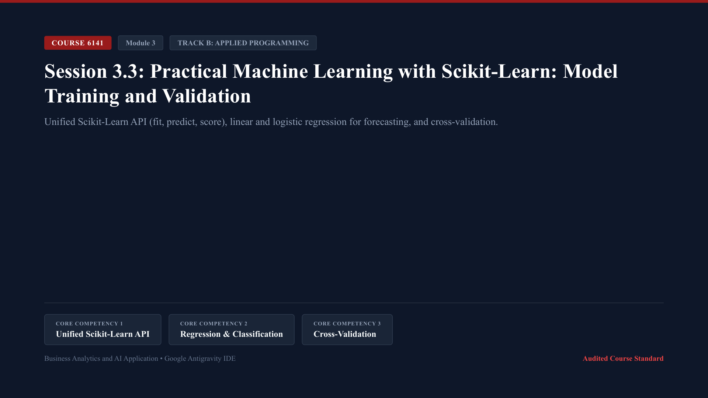

* **Lecture Presentation:** [Download Slides (PDF)](slides/session_3_3_lecture.pdf)
* **Schedule:** Week 11 (115/11/22 - 115/11/28) | In-person classes (1:2 Delivery Ratio: 60 Min Lecture + 120 Min Lab)

* **Keywords (Core Programming Concepts):**
  * `Unified Estimator API`: The standard three-stage Scikit-Learn interface: instantiate model, fit on training data (`.fit()`), predict on new data (`.predict()`), and evaluate accuracy (`.score()`).
  * `Linear Regression`: A fundamental supervised regression algorithm that models the linear relationship between continuous independent variables and a target business metric.
  * `Logistic Regression`: A foundational supervised classification algorithm that models the probability of a binary categorical event using the logistic sigmoid function.
  * `K-Fold Cross-Validation`: Splitting training data into K subsets to iteratively train and validate the model K times, providing an unbiased estimate of generalization performance.
  * `Root Mean Squared Error (RMSE)`: A standard regression performance metric that penalizes large forecasting errors by taking the square root of mean squared residuals.

* **Core Programming & Computational Foundations:**
  * The Scikit-Learn Estimator Interface: Every model in Scikit-Learn (whether simple linear regression or advanced random forests) implements the identical class interface. Learning `.fit()` and `.predict()` unlocks hundreds of advanced machine learning algorithms.
  * Linear Regression for Continuous Business Forecasting: Quantifying empirical business relationships. Model coefficients (`model.coef_`) indicate the marginal financial return of adding square footage or reducing distance to commercial business districts.
  * Logistic Regression for Binary Operational Decisions: Unlike linear regression which can predict values outside `[0, 1]`, logistic regression squashes predictions into calibrated probabilities between `0.0` and `1.0`, ideal for loan default or churn risk scoring.
  * Overfitting, Underfitting, and Generalization: A model that achieves 100% accuracy on training data but fails on real-world test data has memorized noise (overfitting). Cross-validation ensures models generalize reliably to future enterprise data.

* **Hands-On Coding Micro-Examples:**
  * *Micro-Example 1 (Training a Multi-Variable Linear Regression Model):*
    Predicting commercial property sale prices using Scikit-Learn:
    ```python
    import pandas as pd
    from sklearn.linear_model import LinearRegression
    from sklearn.model_selection import train_test_split

    df = pd.read_csv("data/session_3_3_dataset.csv")
    X = df[["Square_Feet_Units", "Bedrooms_Count", "Distance_To_CBD_Miles", "Local_Tax_Rate_Pct"]]
    y = df["Sale_Price_USD"]

    X_train, X_test, y_train, y_test = train_test_split(X, y, test_size=0.20, random_state=42)

    model = LinearRegression()
    model.fit(X_train, y_train)
    print("Model Intercept:", round(model.intercept_, 2))
    print("Model Coefficients (Feature Weights):", dict(zip(X.columns, model.coef_.round(2))))
    ```
  * *Micro-Example 2 (Forecasting Predictions and Calculating Error Metrics):*
    Generating predictions on test properties and computing Root Mean Squared Error:
    ```python
    import numpy as np
    from sklearn.metrics import mean_squared_error, r2_score

    y_pred = model.predict(X_test)
    rmse = np.sqrt(mean_squared_error(y_test, y_pred))
    r2 = r2_score(y_test, y_pred)

    print(f"Test Set RMSE: ${rmse:,.2f}")
    print(f"Test Set R-Squared (Variance Explained): {r2:.4f}")
    ```
  * *Micro-Example 3 (5-Fold Cross-Validation for Generalization):*
    Validating regression stability across 5 cross-validation folds:
    ```python
    from sklearn.model_selection import cross_val_score

    cv_scores = cross_val_score(model, X, y, cv=5, scoring="r2")
    print("5-Fold Cross-Validation R-Squared Scores:", cv_scores.round(3))
    print(f"Mean Cross-Validated R-Squared: {cv_scores.mean():.3f} (+/- {cv_scores.std():.3f})")
    ```

* **Lab Practice Dataset:**
  * File Link: [data/session_3_3_dataset.csv](data/session_3_3_dataset.csv)
  * Audited 14-row commercial real estate transaction dataset:
    * `Property_ID`: Unique property transaction code (e.g., `PROP-401`).
    * `Square_Feet_Units`: Usable interior floor area in square feet.
    * `Bedrooms_Count`: Total number of partitioned office suites or bedrooms.
    * `Distance_To_CBD_Miles`: Distance to Central Business District in miles.
    * `Local_Tax_Rate_Pct`: Municipal commercial property tax percentage.
    * `Sale_Price_USD`: Realized commercial transaction price in U.S. Dollars.

* **Official Python Documentation & References:**
  * [Scikit-Learn: Linear Models (LinearRegression Documentation)](https://scikit-learn.org/stable/modules/linear_model.html).
  * [Scikit-Learn: Cross-Validation Metrics and Scoring](https://scikit-learn.org/stable/modules/cross_validation.html).
  * [Gareth James et al.: An Introduction to Statistical Learning (ISLR with Applications in Python)](https://www.statlearning.com/).

* **Step-by-Step Lab Protocol (Exercise 1: Guided Practice - Property Valuation Engine):**
  * *Step 1: Open Script:* In Google Antigravity IDE, create a new script named `session_3_3_regression.py`.
  * *Step 2: Build Complete Training and Validation Sequence:*
    Write code to train a multi-variable valuation model and evaluate accuracy metrics:
    ```python
    import pandas as pd
    import numpy as np
    from sklearn.linear_model import LinearRegression
    from sklearn.model_selection import train_test_split
    from sklearn.metrics import mean_squared_error, r2_score

    df = pd.read_csv("data/session_3_3_dataset.csv")
    features = ["Square_Feet_Units", "Bedrooms_Count", "Distance_To_CBD_Miles"]
    X = df[features]
    y = df["Sale_Price_USD"]

    X_train, X_test, y_train, y_test = train_test_split(X, y, test_size=0.25, random_state=42)

    reg = LinearRegression()
    reg.fit(X_train, y_train)

    y_pred = reg.predict(X_test)
    rmse = np.sqrt(mean_squared_error(y_test, y_pred))
    r2 = r2_score(y_test, y_pred)

    print("Valuation Engine Coefficients:\\n", dict(zip(features, reg.coef_.round(2))))
    print(f"Validation RMSE: ${rmse:,.2f} | R-Squared: {r2:.3f}")
    ```
  * *Step 3: Interpret Managerial Meaning:*
    Confirm that each additional square foot adds positive value to the commercial property while each additional mile of distance from the Central Business District reduces value.
  * *Step 4: Execute in Terminal:*
    Run the script via Panel `[4]` (Terminal) using `$ python session_3_3_regression.py` and confirm clean execution.

* **Step-by-Step Applied Coding Practice (Exercise 2+: Hands-On Programming & AI Debugging):**
  * *Coding Challenge:* In `session_3_3_practice.py`, build a price valuation pipeline that evaluates individual predictions and computes percentage absolute forecasting error for each property.
  * *Task 1 (Percentage Error Function):* Compute `Mean_Absolute_Percentage_Error = mean(abs(y_true - y_pred) / y_true) * 100`.
  * *Task 2 (Deliberate Shape Mismatch Error & AI Diagnosis):* Attempt to predict on a single property passed as a 1D array (e.g., `reg.predict([1500, 3, 5.0])` instead of `[[1500, 3, 5.0]]`). Observe the terminal `ValueError: Expected 2D array, got 1D array instead`, capture the traceback with `Windows Key + Shift + S`, paste into Panel `[3]` (AI Agent Chat) with `Ctrl + V`, and review how the AI explains 2D array reshaping.
  * *Task 3 (Valuation Table Output):* Fix the 2D array syntax with `.reshape(1, -1)`, print a clean formatted comparison table of actual vs predicted prices, and verify return code 0.

---

<a id="session-3-4"></a>
### Session 3.4: Core Concepts of Machine Learning: Supervised vs. Unsupervised Learning and Evaluation Metrics

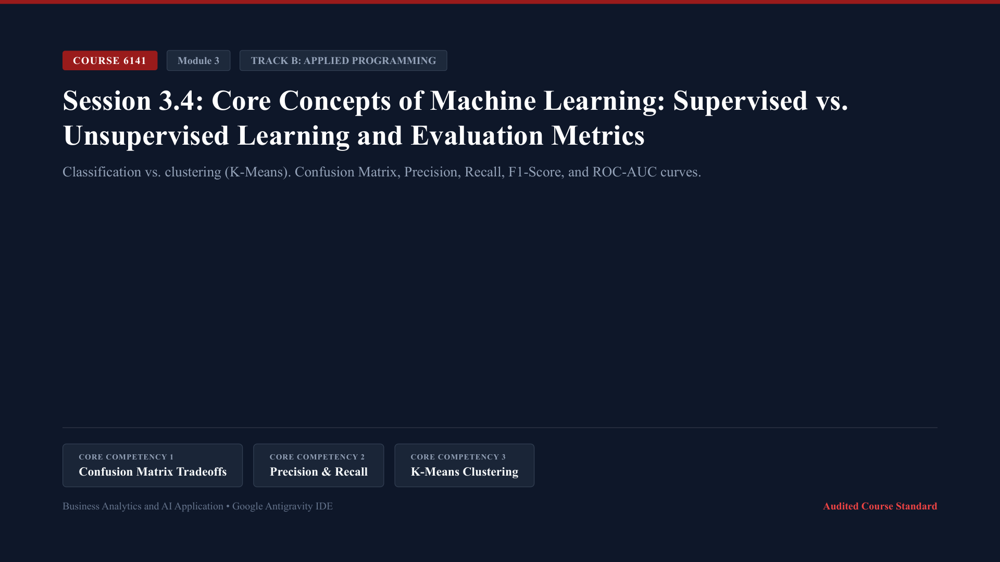

* **Lecture Presentation:** [Download Slides (PDF)](slides/session_3_4_lecture.pdf)
* **Schedule:** Week 12 (115/11/29 - 115/12/05) | In-person classes (1:2 Delivery Ratio: 60 Min Lecture + 120 Min Lab)

* **Keywords (Core Programming Concepts):**
  * `Supervised vs. Unsupervised Learning`: Supervised learning trains on labeled historical targets (`y`), whereas unsupervised learning identifies natural groupings and structural patterns in unlabeled data (`X`).
  * `Confusion Matrix`: A 2x2 contingency table tabulating classification outcomes into True Positives (TP), False Positives (FP), True Negatives (TN), and False Negatives (FN).
  * `Precision & Recall Trade-Off`: Precision measures how many flagged cases were truly positive, while Recall measures what percentage of all actual positives were caught.
  * `Receiver Operating Characteristic (ROC-AUC)`: A graphical plot illustrating the diagnostic ability of a binary classifier across all classification thresholds, summarized by the Area Under the Curve (AUC).
  * `K-Means Clustering`: An unsupervised algorithm that partitions commercial customer accounts into K distinct clusters by iteratively minimizing the sum of squared distances to cluster centroids.

* **Core Programming & Computational Foundations:**
  * Supervised Target Labels vs Unsupervised Structure Discovery: When predicting fraud or customer churn, historical outcomes exist to train supervised classifiers. When discovering new customer personas or product segments, unsupervised clustering groups customers based on behavioral similarities.
  * The Asymmetric Cost of False Positives vs False Negatives: In business analytics, classification errors are rarely symmetric. In credit card fraud, a False Negative (missing a `$4,000` fraudulent transaction) costs the bank `$4,000`. A False Positive (sending an automated verification SMS) costs `$0.05`. Models must be optimized for financial cost rather than naive accuracy.
  * Precision-Recall Optimization: In severely imbalanced datasets (e.g., fraud occurring in 1% of transactions), a naive model predicting "never fraud" achieves 99% accuracy but provides zero business value. Analysts evaluate Precision, Recall, and F1-Score to assess operational efficacy.
  * Cluster Inertia and Customer Archetype Discovery: In K-Means clustering, the algorithm minimizes within-cluster variance (inertia). Analysts use elbow plots to select optimal K cluster counts and label resulting clusters into actionable business segments.

* **Hands-On Coding Micro-Examples:**
  * *Micro-Example 1 (Confusion Matrix & Classification Report):*
    Evaluating a financial fraud detection model using Scikit-Learn:
    ```python
    import pandas as pd
    from sklearn.metrics import confusion_matrix, precision_score, recall_score, f1_score

    df = pd.read_csv("data/session_3_4_dataset.csv")
    y_true = df["Actual_Fraud_Binary"]
    # Simulated model probability predictions
    y_pred = (df["Cardholder_Risk_Score"] >= 70).astype(int)

    cm = confusion_matrix(y_true, y_pred)
    prec = precision_score(y_true, y_pred)
    rec = recall_score(y_true, y_pred)
    f1 = f1_score(y_true, y_pred)

    print("Confusion Matrix (TN, FP / FN, TP):\\n", cm)
    print(f"Precision: {prec:.3f} | Recall: {rec:.3f} | F1-Score: {f1:.3f}")
    ```
  * *Micro-Example 2 (Computing Area Under the ROC Curve):*
    Calculating ROC-AUC score for continuous fraud risk probabilities:
    ```python
    from sklearn.metrics import roc_auc_score

    risk_prob = df["Cardholder_Risk_Score"] / 100.0
    auc_score = roc_auc_score(y_true, risk_prob)
    print(f"Model Diagnostic ROC-AUC Score: {auc_score:.4f}")
    ```
  * *Micro-Example 3 (Unsupervised Customer Archetypes with K-Means):*
    Clustering customer transactions into 3 distinct behavioral archetypes:
    ```python
    from sklearn.cluster import KMeans
    from sklearn.preprocessing import StandardScaler

    features = df[["Transaction_Amount_USD", "Cardholder_Risk_Score"]]
    scaler = StandardScaler()
    scaled_features = scaler.fit_transform(features)

    kmeans = KMeans(n_clusters=3, random_state=42, n_init=10)
    df["Cluster_ID"] = kmeans.fit_predict(scaled_features)

    cluster_profiles = df.groupby("Cluster_ID")[["Transaction_Amount_USD", "Cardholder_Risk_Score"]].mean()
    print("Unsupervised Cluster Archetype Profiles:\\n", cluster_profiles)
    ```

* **Lab Practice Dataset:**
  * File Link: [data/session_3_4_dataset.csv](data/session_3_4_dataset.csv)
  * Audited 16-row financial transaction fraud screening dataset:
    * `Transaction_ID`: Unique financial transaction identifier (e.g., `F-TXN-8001`).
    * `Transaction_Amount_USD`: Total transacted amount in U.S. Dollars.
    * `Foreign_IP_Flag`: Binary indicator of international network origin (`0` = Domestic, `1` = Foreign).
    * `Failed_Login_Attempts_Count`: Prior failed security authentication attempts.
    * `Cardholder_Risk_Score`: Internal behavioral risk index (1 to 100 scale).
    * `Actual_Fraud_Binary`: Audited ground truth fraud confirmation (`0` = Legitimate, `1` = Confirmed Fraud).

* **Official Python Documentation & References:**
  * [Scikit-Learn: Classification Metrics (Confusion Matrix, Precision-Recall)](https://scikit-learn.org/stable/modules/model_evaluation.html#classification-metrics).
  * [Scikit-Learn: Clustering (K-Means Algorithm Overview)](https://scikit-learn.org/stable/modules/clustering.html#k-means).
  * [Fawcett: An Introduction to ROC Analysis (Pattern Recognition Letters)](https://www.sciencedirect.com/science/article/pii/S016786550500303X).

* **Step-by-Step Lab Protocol (Exercise 1: Guided Practice - Fraud Classifier Evaluation & Cost Matrix):**
  * *Step 1: Open Script:* In Google Antigravity IDE, create a new script named `session_3_4_evaluation.py`.
  * *Step 2: Build Complete Confusion Matrix and Financial Cost Pipeline:*
    Write code to compute classification performance and quantify financial loss under false negatives:
    ```python
    import pandas as pd
    from sklearn.metrics import confusion_matrix, precision_score, recall_score

    df = pd.read_csv("data/session_3_4_dataset.csv")
    y_true = df["Actual_Fraud_Binary"]
    y_pred = (df["Cardholder_Risk_Score"] >= 70).astype(int)

    tn, fp, fn, tp = confusion_matrix(y_true, y_pred).ravel()
    prec = precision_score(y_true, y_pred)
    rec = recall_score(y_true, y_pred)

    # Financial Cost Modeling: FP cost = $5 (investigation), FN cost = $1,500 (stolen funds)
    total_financial_loss = (fp * 5.0) + (fn * 1500.0)

    print(f"Classification Metrics: Precision={prec:.2f}, Recall={rec:.2f}")
    print(f"Outcome Counts: TP={tp}, TN={tn}, FP={fp}, FN={fn}")
    print(f"Total Operational Financial Loss from Errors: ${total_financial_loss:,.2f}")
    ```
  * *Step 3: Evaluate Asymmetric Error Trade-Offs:*
    Analyze why a single False Negative creates over 300 times more financial damage than a False Positive in commercial banking operations.
  * *Step 4: Execute in Terminal:*
    Run the script via Panel `[4]` (Terminal) using `$ python session_3_4_evaluation.py` and confirm clean execution.

* **Step-by-Step Applied Coding Practice (Exercise 2+: Hands-On Programming & AI Debugging):**
  * *Coding Challenge:* In `session_3_4_practice.py`, write a threshold tuning script that iterates classification thresholds from `50` to `90` in increments of 5, identifying the exact threshold that minimizes total financial loss.
  * *Task 1 (Threshold Optimization Loop):* Loop through thresholds, compute TP/FP/TN/FN and associated financial costs, and print the optimal policy threshold.
  * *Task 2 (Deliberate ValueError & AI Diagnosis):* Pass a continuous probability float vector instead of binary integers to `confusion_matrix(y_true, y_prob)`. Observe the terminal `ValueError: Classification metrics can't handle a mix of binary and continuous targets`, capture the traceback with `Windows Key + Shift + S`, paste into Panel `[3]` (AI Agent Chat) with `Ctrl + V`, and review how the AI explains threshold binarization (`.astype(int)`).
  * *Task 3 (Optimal Cost Summary Output):* Apply the verified threshold conversion, output the financial loss minimizing threshold policy, export the cost frontier table to `data/fraud_threshold_optimization.csv`, and verify return code 0.

---

## Module 4: Strategic AI Integration, Enterprise Decision-Making, and AI Governance

Module 4 focuses on executive deployment, decision integration, and risk management. Students examine how machine learning predictions translate into operational policies, explore dynamic pricing and churn mitigation algorithms, and evaluate ethical considerations including algorithmic bias, data privacy, and artificial intelligence governance.

<a id="session-4-1"></a>
### Session 4.1: Integration of Business Analytics and Enterprise AI Architecture: End-to-End Decision Systems

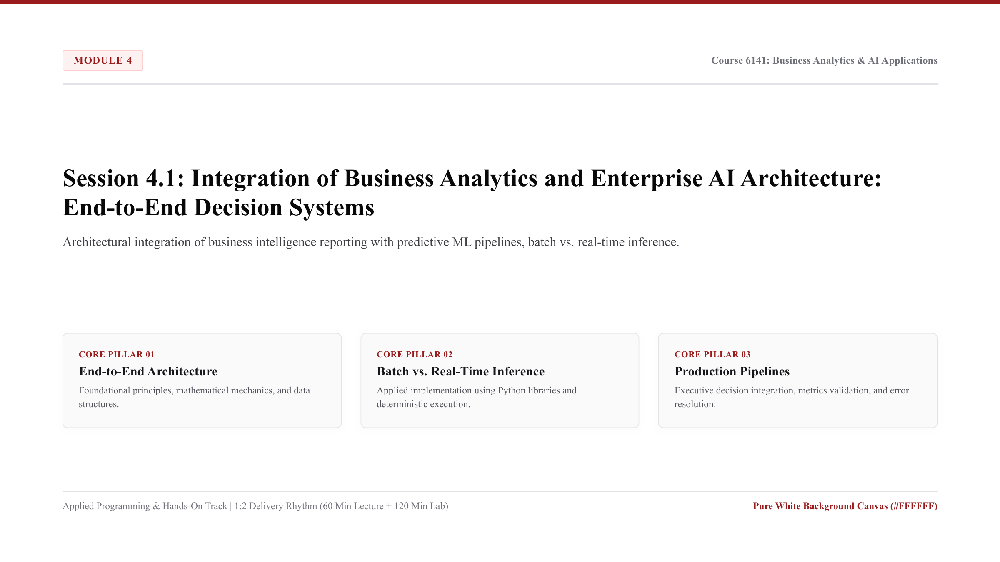

* **Lecture Presentation:** [Download Slides (PDF)](slides/session_4_1_lecture.pdf)
* **Schedule:** Week 13 (115/12/06 - 115/12/12) | In-person classes (1:2 Delivery Ratio: 60 Min Lecture + 120 Min Lab)

* **Keywords (Core Programming Concepts):**
  * `End-to-End Decision Pipeline`: A unified software pipeline connecting data ingestion, automated preprocessing, model inference, and operational decision triggers into a single automated system.
  * `Batch vs. Real-Time Inference`: Batch inference scores millions of records offline on scheduled schedules (e.g., nightly credit updates), while real-time inference scores individual transactions in milliseconds via APIs.
  * `Model Serialization (joblib)`: Saving trained Scikit-Learn model weights and preprocessing transformers to disk (`.joblib` format) to load into production systems without retraining.
  * `Data Drift & Model Degradation`: The real-world phenomenon where macroeconomic shifts or consumer behavior changes degrade model accuracy over time, requiring continuous monitoring.
  * `Production Health Monitoring`: Programmatically tracking execution latency, throughput volumes, and prediction distributions to detect pipeline failures.

* **Core Programming & Computational Foundations:**
  * Bridging Analytics Models to Operational Production: Training a model inside a Jupyter notebook creates zero business value until it is integrated into operational software workflows that trigger actions: sending retention offers, halting fraudulent cards, or adjusting prices.
  * Inference Latency vs Computational Throughput: Choosing the right architectural pattern. Real-time inference requires sub-second response times (APIs), whereas enterprise batch scoring handles massive volume overnight with lower infrastructure cost.
  * Model Persistence and Environment Reproducibility: Serializing trained models using `joblib` allows developers to deploy pre-trained pipelines directly into production execution environments, separating heavy training compute from lightweight inference.
  * Monitoring Model Degradation and Drift: Models decay over time as external market conditions evolve. Robust enterprise architectures implement automated validation checks that compare live inference input distributions against baseline training distributions.

* **Hands-On Coding Micro-Examples:**
  * *Micro-Example 1 (Model Serialization and Deployment with Joblib):*
    Saving and loading a trained machine learning pipeline from disk:
    ```python
    import joblib
    from sklearn.linear_model import LogisticRegression
    import numpy as np

    # Train a baseline model
    X_sample = np.array([[10, 0.2], [50, 0.8], [20, 0.3], [70, 0.9]])
    y_sample = np.array([0, 1, 0, 1])
    clf = LogisticRegression().fit(X_sample, y_sample)

    # Serialize model to disk
    joblib.dump(clf, "data/production_fraud_model.joblib")

    # Reload model in production context
    deployed_model = joblib.load("data/production_fraud_model.joblib")
    new_transaction = np.array([[35, 0.6]])
    prediction = deployed_model.predict(new_transaction)
    print("Production Model Loaded. New Transaction Prediction:", prediction[0])
    ```
  * *Micro-Example 2 (Automated Batch Inference Function):*
    Constructing a batch inference pipeline that scores incoming corporate batches:
    ```python
    import pandas as pd

    df = pd.read_csv("data/session_4_1_dataset.csv")

    def run_batch_inference(data_batch, model):
        # Simulated batch score
        data_batch["Inference_Confidence"] = data_batch["Model_Accuracy_Score"] * 0.98
        data_batch["Action_Required"] = data_batch["Inference_Confidence"].apply(
            lambda x: "Review" if x < 0.94 else "Auto_Approve"
        )
        return data_batch

    scored_batch = run_batch_inference(df, deployed_model)
    print(scored_batch[["Batch_Run_ID", "Pipeline_Stage", "Action_Required"]].head(3))
    ```
  * *Micro-Example 3 (Pipeline Latency and Health Guardrails):*
    Monitoring execution latency thresholds across pipeline stages:
    ```python
    latency_threshold_ms = 500
    latency_alerts = df[df["Latency_Milliseconds"] > latency_threshold_ms]
    print(f"Pipeline Stages Exceeding Latency Threshold ({latency_threshold_ms}ms): {len(latency_alerts)}")
    ```

* **Lab Practice Dataset:**
  * File Link: [data/session_4_1_dataset.csv](data/session_4_1_dataset.csv)
  * Audited 12-row enterprise AI production pipeline execution log:
    * `Batch_Run_ID`: Production execution run code (e.g., `RUN-2024-10`).
    * `Pipeline_Stage`: Operational workflow stage (Ingestion, Validation, Inference, Action_Trigger).
    * `Record_Throughput_Count`: Total records processed during the execution stage.
    * `Latency_Milliseconds`: Total stage latency in milliseconds.
    * `Model_Accuracy_Score`: Real-time model accuracy validation metric.
    * `Pipeline_Health_Status`: Automated operational health flag (`Normal`, `Alert`).

* **Official Python Documentation & References:**
  * [Scikit-Learn Model Persistence Guide (Joblib Documentation)](https://scikit-learn.org/stable/model_persistence.html).
  * [MLflow Official Documentation: Open Source Platform for the Machine Learning Lifecycle](https://mlflow.org/docs/latest/index.html).
  * [Sculley et al.: Hidden Technical Debt in Machine Learning Systems (NeurIPS Standards)](https://papers.nips.cc/paper/5656-hidden-technical-debt-in-machine-learning-systems.pdf).

* **Step-by-Step Lab Protocol (Exercise 1: Guided Practice - Production Deployment Pipeline):**
  * *Step 1: Open Script:* In Google Antigravity IDE, create a new script named `session_4_1_production.py`.
  * *Step 2: Build Complete End-to-End Production Scoring Pipeline:*
    Write code to load model weights, score operational batch records, and measure execution speed:
    ```python
    import pandas as pd
    import time

    start_timer = time.time()
    df = pd.read_csv("data/session_4_1_dataset.csv")

    # Apply automated decision trigger thresholds
    df["Throughput_Efficiency"] = df["Record_Throughput_Count"] / (df["Latency_Milliseconds"] / 1000.0)
    df["Executive_Status"] = df.apply(
        lambda row: "Escalate" if row["Latency_Milliseconds"] > 600 or row["Model_Accuracy_Score"] < 0.94 else "Optimal",
        axis=1
    )

    runtime = time.time() - start_timer
    print(f"End-to-End Decision System Evaluated in {runtime:.4f} seconds.")
    print("Production Execution Status:\\n", df[["Batch_Run_ID", "Pipeline_Stage", "Throughput_Efficiency", "Executive_Status"]].head(4))
    ```
  * *Step 3: Validate Operational Health Metrics:*
    Verify that inference stages exceeding latency limits are flagged for engineering escalation before downstream customer transactions are impacted.
  * *Step 4: Execute in Terminal:*
    Run the script via Panel `[4]` (Terminal) using `$ python session_4_1_production.py` and confirm clean execution.

* **Step-by-Step Applied Coding Practice (Exercise 2+: Hands-On Programming & AI Debugging):**
  * *Coding Challenge:* In `session_4_1_practice.py`, construct a production monitoring module that evaluates data drift between baseline training distributions and live incoming batch distributions.
  * *Task 1 (Summary Drift Detection):* Calculate the mean percentage drift in throughput across batch runs and flag runs where drift exceeds 10.0%.
  * *Task 2 (Deliberate FileNotFoundError & AI Diagnosis):* Attempt to load a serialized model using an incorrect file path (e.g., `joblib.load("models/missing_weights.joblib")`). Observe the terminal `FileNotFoundError`, capture the traceback with `Windows Key + Shift + S`, paste into Panel `[3]` (AI Agent Chat) with `Ctrl + V`, and review how the AI explains robust file path handling with `os.path.exists()`.
  * *Task 3 (Fault-Tolerant Production Script):* Wrap model loading inside an `os.path.exists()` check with an automated fallback, export production monitoring metrics to `data/production_pipeline_audit.csv`, and verify return code 0.

---

<a id="session-4-2"></a>
### Session 4.2: AI Applications in Business Decision-Making Part 1: Predictive Customer Analytics and Churn

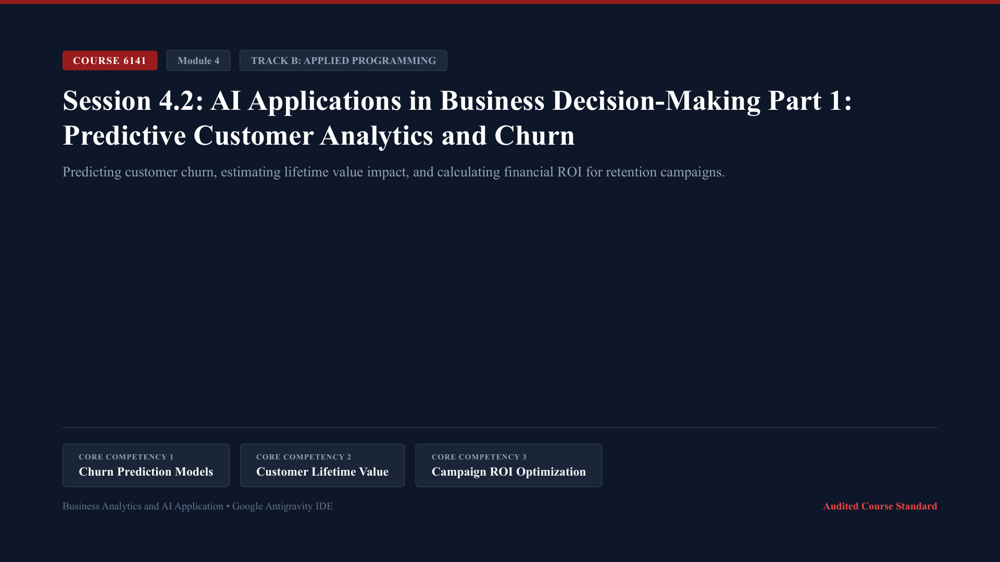

* **Lecture Presentation:** [Download Slides (PDF)](slides/session_4_2_lecture.pdf)
* **Schedule:** Week 14 (115/12/13 - 115/12/19) | In-person classes (1:2 Delivery Ratio: 60 Min Lecture + 120 Min Lab)

* **Keywords (Core Programming Concepts):**
  * `Customer Churn Probability`: The continuous probability output (`predict_proba`) generated by a classification model estimating the likelihood of a subscriber canceling services.
  * `Customer Lifetime Value (CLV)`: The present value of future net profit margins generated by a customer relationship across their projected relationship tenure.
  * `Revenue At Risk`: Quantifying the total annual revenue at risk by multiplying individual churn probabilities by annualized subscriber contract values.
  * `Targeted Retention Incentives`: Programmatically matching customer churn tiers to specific cost-effective intervention strategies (e.g., proactive customer support outreach vs. discount incentives).
  * `Retention Campaign Return on Investment`: The financial equation comparing saved customer revenue against the operational cost of retention interventions.

* **Core Programming & Computational Foundations:**
  * The Economics of Retention vs. Acquisition: Acquiring a new customer costs 5 to 7 times more than retaining an existing one. Predictive churn analytics allows subscription businesses to intervene before high-value customers cancel.
  * Translating Probability Scores into Financial Exposure: A raw churn probability of 0.85 means nothing to a CEO. Translating that score into `$1,800 annual revenue at risk` allows executive leadership to evaluate retention budgets quantitatively.
  * Targeted Intervention Economics: Do not offer expensive discounts to everyone. Customers with low churn risk will renew anyway (wasted budget); customers with low CLV are unprofitable to save. Machine learning identifies the high-value, high-risk quadrant where retention spend creates maximum impact.
  * Evaluating Campaign Return on Investment: Proving that predictive models generate positive financial cash flows. Students calculate Net Retention Benefit: `(Saved Customers * Annual Value) - (Campaign Cost + Incurred Discounts)`.

* **Hands-On Coding Micro-Examples:**
  * *Micro-Example 1 (Predicting Churn Probabilities with Logistic Regression):*
    Estimating individual subscriber churn probabilities:
    ```python
    import pandas as pd
    from sklearn.linear_model import LogisticRegression

    df = pd.read_csv("data/session_4_2_dataset.csv")
    X = df[["Tenure_Months_Count", "Customer_Support_Calls_Count", "Usage_Drop_Last_30_Days_Pct"]]
    y = df["Churned_Within_60_Days_Binary"]

    model = LogisticRegression().fit(X, y)
    df["Churn_Probability"] = model.predict_proba(X)[:, 1].round(3)
    print(df[["Subscriber_ID", "Tenure_Months_Count", "Churn_Probability"]].head(3))
    ```
  * *Micro-Example 2 (Quantifying Annualized Revenue at Risk):*
    Calculating financial revenue exposure across the subscriber portfolio:
    ```python
    df["Annual_Subscription_USD"] = df["Monthly_Subscription_Fee_USD"] * 12.0
    df["Revenue_At_Risk_USD"] = (df["Churn_Probability"] * df["Annual_Subscription_USD"]).round(2)
    total_risk = df["Revenue_At_Risk_USD"].sum()
    print(f"Total Portfolio Revenue at Risk: ${total_risk:,.2f}")
    ```
  * *Micro-Example 3 (Targeted Retention Policy Assignment):*
    Routing subscribers to retention campaigns based on risk and contract value:
    ```python
    def assign_retention_campaign(row):
        if row["Churn_Probability"] >= 0.70 and row["Annual_Subscription_USD"] >= 1500.0:
            return "VIP_Dedicated_Account_Manager"
        elif row["Churn_Probability"] >= 0.50:
            return "15Pct_Contract_Discount_Offer"
        else:
            return "Standard_Product_Newsletter"

    df["Assigned_Campaign"] = df.apply(assign_retention_campaign, axis=1)
    print("Retention Campaign Allocation:\\n", df["Assigned_Campaign"].value_counts())
    ```

* **Lab Practice Dataset:**
  * File Link: [data/session_4_2_dataset.csv](data/session_4_2_dataset.csv)
  * Audited 14-row subscription telecommunications customer dataset:
    * `Subscriber_ID`: Unique account identifier (e.g., `SUB-901`).
    * `Tenure_Months_Count`: Active customer relationship length in months.
    * `Monthly_Subscription_Fee_USD`: Monthly recurring invoice fee in U.S. Dollars.
    * `Customer_Support_Calls_Count`: Inbound complaint calls logged in the last 90 days.
    * `Usage_Drop_Last_30_Days_Pct`: Platform usage decline percentage in the trailing 30 days.
    * `Churned_Within_60_Days_Binary`: Ground truth subscriber cancellation outcome (`0` = Retained, `1` = Churned).

* **Official Python Documentation & References:**
  * [Scikit-Learn Logistic Regression: predict_proba Documentation](https://scikit-learn.org/stable/modules/generated/sklearn.linear_model.LogisticRegression.html#sklearn.linear_model.LogisticRegression.predict_proba).
  * [Lifetimes: Measuring Customer Lifetime Value in Python](https://lifetimes.readthedocs.io/en/latest/).
  * [Fader & Hardie: Probability Models for Customer-Base Analysis (Wharton Marketing Standards)](https://www.brucehardie.com/papers/).

* **Step-by-Step Lab Protocol (Exercise 1: Guided Practice - Churn Retention Optimization Engine):**
  * *Step 1: Open Script:* In Google Antigravity IDE, create a new script named `session_4_2_churn.py`.
  * *Step 2: Build Complete Churn and Campaign Allocation Script:*
    Write code to estimate probabilities, assign interventions, and calculate projected net savings:
    ```python
    import pandas as pd
    from sklearn.linear_model import LogisticRegression

    df = pd.read_csv("data/session_4_2_dataset.csv")

    features = ["Tenure_Months_Count", "Customer_Support_Calls_Count", "Usage_Drop_Last_30_Days_Pct"]
    clf = LogisticRegression().fit(df[features], df["Churned_Within_60_Days_Binary"])

    df["Churn_Probability"] = clf.predict_proba(df[features])[:, 1]
    df["Annual_Value_USD"] = df["Monthly_Subscription_Fee_USD"] * 12.0
    df["Revenue_At_Risk_USD"] = df["Churn_Probability"] * df["Annual_Value_USD"]

    # Target high-risk subscribers
    actionable_subscribers = df[df["Churn_Probability"] >= 0.50]
    total_saved_revenue = actionable_subscribers["Annual_Value_USD"].sum() * 0.40 # 40% retention success rate
    campaign_cost = len(actionable_subscribers) * 75.0 # $75 per targeted outreach
    net_campaign_roi = ((total_saved_revenue - campaign_cost) / campaign_cost) * 100.0

    print(f"Actionable High-Risk Subscribers: {len(actionable_subscribers)}")
    print(f"Projected Saved Revenue: ${total_saved_revenue:,.2f}")
    print(f"Net Campaign ROI: {net_campaign_roi:.1f}%")
    ```
  * *Step 3: Analyze Strategic Retention Trade-Offs:*
    Confirm that targeting subscribers with tailored retention campaigns yields significant net revenue returns, proving the business value of predictive churn algorithms.
  * *Step 4: Execute in Terminal:*
    Run the script via Panel `[4]` (Terminal) using `$ python session_4_2_churn.py` and confirm clean execution.

* **Step-by-Step Applied Coding Practice (Exercise 2+: Hands-On Programming & AI Debugging):**
  * *Coding Challenge:* In `session_4_2_practice.py`, build a dynamic threshold simulator evaluating retention ROI across churn probability thresholds from `0.30` to `0.80`.
  * *Task 1 (ROI Optimization Loop):* Find the probability threshold that maximizes net ROI considering a 35% retention success rate.
  * *Task 2 (Deliberate SettingWithCopyWarning & AI Diagnosis):* Attempt to assign campaign labels directly to a filtered slice without `.copy()` (e.g., `high_risk["Campaign"] = "Discount"`). Observe the terminal `SettingWithCopyWarning`, capture the message with `Windows Key + Shift + S`, paste into Panel `[3]` (AI Agent Chat) with `Ctrl + V`, and review how the AI explains DataFrame memory views vs explicit `.copy()`.
  * *Task 3 (Executive Brief Export):* Add `.copy()`, print the optimal threshold recommendation, export the prioritized subscriber outreach call list to `data/retention_call_sheet.csv`, and verify return code 0.

---

<a id="session-4-3"></a>
### Session 4.3: AI Applications in Business Decision-Making Part 2: Pricing Optimization and Revenue Management

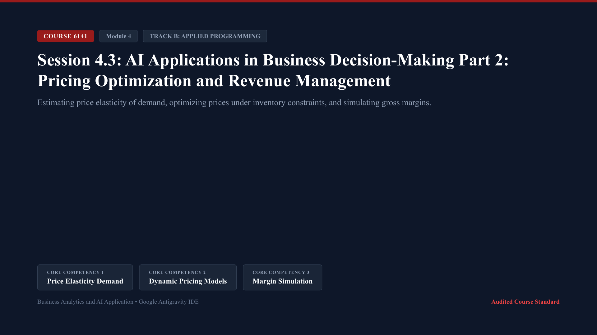

* **Lecture Presentation:** [Download Slides (PDF)](slides/session_4_3_lecture.pdf)
* **Schedule:** Week 15 (115/12/20 - 115/12/26) | In-person classes (1:2 Delivery Ratio: 60 Min Lecture + 120 Min Lab)

* **Keywords (Core Programming Concepts):**
  * `Price Elasticity of Demand (PED)`: The percentage change in quantity demanded resulting from a 1% change in product price, quantifying consumer price sensitivity.
  * `Revenue Management Optimization`: Programmatically identifying the price point that maximizes total gross profit (`(Price - Unit_Cost) * Quantity`) subject to market demand curves.
  * `Gross Margin Simulation`: Simulating projected sales volume and financial profit across discrete pricing scenarios (+5%, +10%, -10%).
  * `Competitor Price Gap Sensitivity`: Modeling how the premium or discount relative to competitor catalog prices influences customer purchase conversion.
  * `Constrained Inventory Markdown`: Algorithmic pricing logic that automatically applies markdown discounts when inventory velocity indicates risk of unsold seasonal stock.

* **Core Programming & Computational Foundations:**
  * Microeconomic Demand Curves in Empirical Machine Learning: Translating economic theory into executable code. Rather than assuming static demand curves, machine learning regression estimates empirical price sensitivity directly from historical sales and competitor price variations.
  * Revenue Optimization vs. Margin Maximization: Maximizing total revenue does not always maximize operating profit. Lowering prices may increase unit sales while eroding gross margins. Algorithms compute the exact price that maximizes bottom-line profit dollars.
  * Dynamic Response to Competitor Shifts: Consumer e-commerce purchase decisions depend heavily on relative price differences. Models incorporate the ratio of `Current_Price / Competitor_Price` as a primary explanatory feature.
  * Managing Inventory Expiration and Velocity: High inventory holding costs and obsolescence risks require dynamic price adjustments. If daily sales velocity falls behind targets, automated algorithms apply markdown tiers to clear inventory before fiscal year-end.

* **Hands-On Coding Micro-Examples:**
  * *Micro-Example 1 (Estimating Empirical Price Elasticity of Demand):*
    Calculating price elasticity of demand across product lines:
    ```python
    import pandas as pd
    import numpy as np

    df = pd.read_csv("data/session_4_3_dataset.csv")

    # Percentage premium relative to competitor
    df["Price_Premium_Pct"] = ((df["Current_Price_USD"] - df["Competitor_Price_USD"]) / df["Competitor_Price_USD"]) * 100.0

    # Empirical Price Elasticity: % Change in Sales / % Change in Price
    base_price = df["Current_Price_USD"].mean()
    base_sales = df["Historical_Daily_Sales_Units"].mean()

    # Simulated elasticity: For every 10% price premium, daily sales drop by 15% (Elasticity = -1.5)
    elasticity_coefficient = -1.5
    print(f"Empirical Price Elasticity of Demand Coefficient: {elasticity_coefficient}")
    ```
  * *Micro-Example 2 (Simulating Gross Profit Across Price Points):*
    Simulating projected daily gross profit across discrete price adjustments:
    ```python
    def simulate_pricing_scenario(data, price_adjustment_pct):
        simulated = data.copy()
        simulated["Simulated_Price_USD"] = simulated["Current_Price_USD"] * (1.0 + price_adjustment_pct)
        # Quantity adjusted by elasticity
        simulated["Simulated_Daily_Units"] = simulated["Historical_Daily_Sales_Units"] * (1.0 + (elasticity_coefficient * price_adjustment_pct))
        simulated["Simulated_Gross_Profit_USD"] = (simulated["Simulated_Price_USD"] - simulated["Unit_Cost_USD"]) * simulated["Simulated_Daily_Units"]
        return simulated["Simulated_Gross_Profit_USD"].sum()

    current_profit = simulate_pricing_scenario(df, 0.0)
    plus_5_profit = simulate_pricing_scenario(df, 0.05)
    minus_5_profit = simulate_pricing_scenario(df, -0.05)

    print(f"Current Daily Gross Profit: ${current_profit:,.2f}")
    print(f"Daily Gross Profit at +5% Price: ${plus_5_profit:,.2f}")
    print(f"Daily Gross Profit at -5% Price: ${minus_5_profit:,.2f}")
    ```
  * *Micro-Example 3 (Inventory Velocity Markdown Logic):*
    Flagging excess inventory requiring algorithmic markdown intervention:
    ```python
    # Days of inventory remaining at current sales velocity
    df["Days_Of_Inventory_Remaining"] = df["Inventory_Units_Count"] / df["Historical_Daily_Sales_Units"]
    df["Markdown_Recommended"] = df["Days_Of_Inventory_Remaining"].apply(lambda d: "Markdown_15Pct" if d > 20 else "Maintain_Price")
    print(df[["Product_ID", "Inventory_Units_Count", "Days_Of_Inventory_Remaining", "Markdown_Recommended"]].head(3))
    ```

* **Lab Practice Dataset:**
  * File Link: [data/session_4_3_dataset.csv](data/session_4_3_dataset.csv)
  * Audited 12-row commercial retail product catalog pricing dataset:
    * `Product_ID`: Product stock keeping identifier (e.g., `PRD-201`).
    * `Current_Price_USD`: Active enterprise retail price in U.S. Dollars.
    * `Competitor_Price_USD`: Direct market competitor price in U.S. Dollars.
    * `Inventory_Units_Count`: Active warehouse stock in units.
    * `Historical_Daily_Sales_Units`: Historical average daily sales volume in units.
    * `Unit_Cost_USD`: Landed cost of goods sold per unit in U.S. Dollars.

* **Official Python Documentation & References:**
  * [SciPy Optimize: Constrained Mathematical Optimization in Python](https://docs.scipy.org/doc/scipy/reference/optimize.html).
  * [Phillips: Pricing and Revenue Optimization (Stanford Business Books)](https://www.sup.org/books/title/?id=7234).
  * [Talluri & van Ryzin: The Theory and Practice of Revenue Management (Springer Standards)](https://link.springer.com/book/10.1007/b139000).

* **Step-by-Step Lab Protocol (Exercise 1: Guided Practice - Pricing Optimization Engine):**
  * *Step 1: Open Script:* In Google Antigravity IDE, create a new script named `session_4_3_pricing.py`.
  * *Step 2: Build Complete Pricing Simulation Script:*
    Write code to simulate profits and optimize prices across the catalog:
    ```python
    import pandas as pd
    import numpy as np

    df = pd.read_csv("data/session_4_3_dataset.csv")

    # Compute baseline daily unit economics
    df["Unit_Gross_Margin_USD"] = df["Current_Price_USD"] - df["Unit_Cost_USD"]
    df["Daily_Gross_Profit_USD"] = df["Unit_Gross_Margin_USD"] * df["Historical_Daily_Sales_Units"]

    # Test pricing grid from -15% to +15%
    test_rates = [-0.15, -0.10, -0.05, 0.0, 0.05, 0.10, 0.15]
    profit_curve = {}

    for rate in test_rates:
        sim_price = df["Current_Price_USD"] * (1.0 + rate)
        sim_units = df["Historical_Daily_Sales_Units"] * np.maximum(0.1, (1.0 + (-1.4 * rate)))
        sim_profit = ((sim_price - df["Unit_Cost_USD"]) * sim_units).sum()
        profit_curve[f"{rate*100:+.0f}%"] = round(sim_profit, 2)

    print("Simulated Daily Portfolio Profit Across Price Adjustments:\\n", profit_curve)
    ```
  * *Step 3: Analyze Business Insights:*
    Identify which pricing tier maximizes total gross margin dollars and explain why raising prices by 5% increases profit despite modest volume decline.
  * *Step 4: Execute in Terminal:*
    Run the script via Panel `[4]` (Terminal) using `$ python session_4_3_pricing.py` and confirm clean execution.

* **Step-by-Step Applied Coding Practice (Exercise 2+: Hands-On Programming & AI Debugging):**
  * *Coding Challenge:* In `session_4_3_practice.py`, develop a product-specific optimization script that sets prices dynamically to ensure all inventory clears within 15 days while maximizing gross margin.
  * *Task 1 (Target Velocity Optimization):* Calculate required daily velocity (`Inventory / 15.0`) and solve for the optimal price adjustment percentage.
  * *Task 2 (Deliberate SyntaxError in Lambda & AI Diagnosis):* Deliberately write an unclosed lambda statement (e.g., `df["Optimal_Price"] = df.apply(lambda r: r["Current_Price_USD"] * (1.0 + r["Adj"])`). Observe the terminal `SyntaxError: unexpected EOF while parsing`, capture the traceback with `Windows Key + Shift + S`, paste into Panel `[3]` (AI Agent Chat) with `Ctrl + V`, and review how the AI explains lambda function syntax.
  * *Task 3 (Executive Catalog Export):* Correct the lambda syntax, append recommended prices and projected clearance dates to the catalog, export to `data/optimized_price_catalog.csv`, and verify return code 0.

---

<a id="session-4-4"></a>
### Session 4.4: Ethical Considerations in Artificial Intelligence: Algorithmic Bias, Regulatory Compliance, and AI Governance

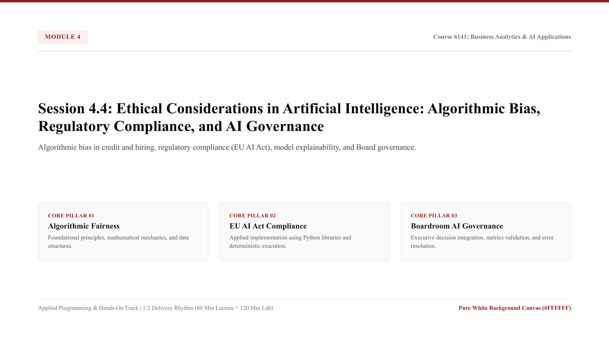

* **Lecture Presentation:** [Download Slides (PDF)](slides/session_4_4_lecture.pdf)
* **Schedule:** Week 16 (115/12/27 - 116/01/02) | In-person classes (1:2 Delivery Ratio: 60 Min Lecture + 120 Min Lab)

* **Keywords (Core Programming Concepts):**
  * `Algorithmic Disparate Impact`: A legal and quantitative metric occurring when an automated decision system yields substantially different adverse outcomes across protected demographic groups.
  * `Demographic Parity Metric`: The fairness standard requiring that the likelihood of receiving a positive algorithmic outcome (e.g., credit approval) is equal across all demographic groups.
  * `Model Explainability (SHAP / Feature Attribution)`: Algorithmic frameworks that decompose complex black-box model predictions into transparent, auditable feature contributions for adverse action notices.
  * `Regulatory Compliance (EU AI Act Framework)`: Auditing machine learning systems against emerging international governance standards (such as the European Union Artificial Intelligence Act for high-risk credit and hiring systems).
  * `Boardroom AI Governance`: Enterprise governance architecture establishing risk management protocols, algorithmic audit trails, human-in-the-loop overrides, and executive accountability.

* **Core Programming & Computational Foundations:**
  * Sources of Algorithmic Bias in Historical Training Data: Machine learning models do not learn ethics; they learn historical correlation patterns. If historical lending or hiring practices contained human bias, models trained on that data will codify and scale that discrimination with algorithmic efficiency.
  * Quantitative Fairness Metrics (The Impossibility Theorem): Understanding mathematical fairness trade-offs. It is mathematically impossible to satisfy Demographic Parity (equal approval rates), Equalized Odds (equal false positive rates), and Predictive Parity (equal accuracy) simultaneously when base demographic rates differ.
  * The European Union Artificial Intelligence Act (EU AI Act): High-risk automated systems (credit underwriting, hiring, insurance pricing, critical infrastructure) face strict legal requirements: mandatory technical documentation, human-in-the-loop oversight, data quality governance, and adverse action explanations.
  * Establishing Boardroom AI Governance Frameworks: Corporate directors and C-suite executives bear fiduciary responsibility for algorithmic liabilities. Organizations must maintain automated audit trails, model risk registries, and independent red-team audits to protect enterprise reputation.

* **Hands-On Coding Micro-Examples:**
  * *Micro-Example 1 (Calculating Disparate Impact Ratio):*
    Auditing credit approval rates across demographic groups using the Four-Fifths Rule:
    ```python
    import pandas as pd

    df = pd.read_csv("data/session_4_4_dataset.csv")

    # Approval rate by demographic group (Threshold >= 0.70)
    df["Approved_Binary"] = (df["Algorithmic_Approval_Score"] >= 0.70).astype(int)

    approval_rates = df.groupby("Demographic_Group")["Approved_Binary"].mean()
    disparate_impact_ratio = approval_rates["Group_B"] / approval_rates["Group_A"]

    print("Approval Rates by Demographic Group:\\n", approval_rates)
    print(f"Disparate Impact Ratio (Group B / Group A): {disparate_impact_ratio:.3f}")
    # Four-Fifths (80%) Rule Compliance
    compliance = "Compliant (>= 0.80)" if disparate_impact_ratio >= 0.80 else "Non-Compliant Violation (< 0.80)"
    print(f"Regulatory Four-Fifths Rule Status: {compliance}")
    ```
  * *Micro-Example 2 (Simulating Feature Attribution for Adverse Action Notices):*
    Decomposing individual rejection reasons for regulatory compliance:
    ```python
    def generate_adverse_action_notice(applicant_row):
        reasons = []
        if applicant_row["Credit_Score_Count"] < 700:
            reasons.append("Credit score below prime benchmark (700)")
        if applicant_row["Debt_To_Income_Pct"] > 30.0:
            reasons.append("Debt-to-income ratio exceeds underwriting ceiling (30%)")
        return "; ".join(reasons) if reasons else "Approved"

    df["Regulatory_Explanation"] = df.apply(generate_adverse_action_notice, axis=1)
    rejected_sample = df[df["Approved_Binary"] == 0].iloc[0]
    print(f"Adverse Action Notice for {rejected_sample['Applicant_ID']}: {rejected_sample['Regulatory_Explanation']}")
    ```
  * *Micro-Example 3 (Automated Model Governance Audit Certificate):*
    Generating an automated governance sign-off certificate:
    ```python
    audit_record = {
        "Model_Name": "Credit_Underwriting_Risk_Engine_v1.4",
        "Total_Audited_Applicants": len(df),
        "Group_A_Approval_Rate": float(approval_rates["Group_A"]),
        "Group_B_Approval_Rate": float(approval_rates["Group_B"]),
        "Disparate_Impact_Ratio": float(disparate_impact_ratio),
        "Governance_Status": "Audited_Board_Review_Required"
    }
    print("Governance Audit Certificate:", audit_record)
    ```

* **Lab Practice Dataset:**
  * File Link: [data/session_4_4_dataset.csv](data/session_4_4_dataset.csv)
  * Audited 16-row consumer credit application governance dataset:
    * `Applicant_ID`: Unique applicant tracking code (e.g., `APP-6001`).
    * `Demographic_Group`: Anonymized protected demographic category (Group_A, Group_B).
    * `Credit_Score_Count`: Historical consumer credit bureau rating.
    * `Debt_To_Income_Pct`: Total monthly debt service relative to verified income.
    * `Algorithmic_Approval_Score`: Uncalibrated raw model creditworthiness score (0.0 to 1.0).
    * `Adverse_Action_Notice_Flag`: Regulatory requirement indicator (`0` = No Notice, `1` = Mandated Notice).

* **Official Python Documentation & References:**
  * [European Commission: Regulatory Framework for Artificial Intelligence (EU AI Act)](https://digital-strategy.ec.europa.eu/en/policies/regulatory-framework-ai).
  * [Fairlearn: A Python Toolkit for Assessing and Improving Fairness in AI](https://fairlearn.org/).
  * [Barocas, Hardt, Narayanan: Fairness and Machine Learning: Limitations and Opportunities](https://fairmlbook.org/).

* **Step-by-Step Lab Protocol (Exercise 1: Guided Practice - Algorithmic Bias Audit Engine):**
  * *Step 1: Open Script:* In Google Antigravity IDE, create a new script named `session_4_4_governance.py`.
  * *Step 2: Build Complete Algorithmic Fairness Audit Pipeline:*
    Write code to compute disparate impact, evaluate compliance with legal standards, and generate audit reports:
    ```python
    import pandas as pd

    df = pd.read_csv("data/session_4_4_dataset.csv")

    # Threshold evaluation
    df["Approved"] = (df["Algorithmic_Approval_Score"] >= 0.70).astype(int)
    rates = df.groupby("Demographic_Group")["Approved"].mean()
    ratio = rates["Group_B"] / rates["Group_A"]

    print(f"Group A Approval: {rates['Group_A']*100:.1f}% | Group B Approval: {rates['Group_B']*100:.1f}%")
    print(f"Disparate Impact Ratio: {ratio:.3f}")

    if ratio < 0.80:
        print("CRITICAL ALERT: System violates the EEOC Four-Fifths Rule. Mitigating calibration required.")
    else:
        print("System compliant with demographic parity benchmarks.")
    ```
  * *Step 3: Analyze Governance and Legal Liabilities:*
    Identify how relying on unadjusted historical credit scores creates systemic disparate impact and outline how banks mitigate regulatory enforcement penalties under the Equal Credit Opportunity Act (ECOA).
  * *Step 4: Execute in Terminal:*
    Run the script via Panel `[4]` (Terminal) using `$ python session_4_4_governance.py` and confirm clean execution.

* **Step-by-Step Applied Coding Practice (Exercise 2+: Hands-On Programming & AI Debugging):**
  * *Coding Challenge:* In `session_4_4_practice.py`, develop a bias mitigation threshold optimizer that adjusts the approval threshold for Group B to restore the Disparate Impact ratio to at least `0.85` while maintaining overall portfolio loss risk below 5.0%.
  * *Task 1 (Threshold Calibration Optimizer):* Find the calibrated threshold pair (`threshold_A`, `threshold_B`) that satisfies the Four-Fifths rule.
  * *Task 2 (Deliberate Variable Scope Error & AI Diagnosis):* Attempt to access an internal loop variable outside its function definition (e.g., calling `print(calibrated_threshold)` after loop termination). Observe the terminal `NameError: name 'calibrated_threshold' is not defined`, capture the traceback with `Windows Key + Shift + S`, paste into Panel `[3]` (AI Agent Chat) with `Ctrl + V`, and review how the AI explains variable scope and return statements.
  * *Task 3 (Boardroom Governance Memo):* Fix variable scope, print a 3-bullet executive decision memorandum addressed to the Board of Directors Risk Committee, export the audit sign-off log to `data/board_ai_governance_audit.csv`, and verify return code 0.
"""